<ul>
   <li><a href="#home">一、掌上学堂介绍</a></li>
   <li><a href="#course_type">二、课程分类介绍</a></li>
   <li><a href="#push_course">三、发布视频</a></li>
   <li><a href="#online_play">四、在线直播</a></li>
   <li><a href="#course_play">五、视频播放&评论&点赞</a></li>
   <li><a href="#pc_manage">六、PC Web后端管理</a></li>
</ul>

#### 一、掌上学堂介绍  

掌上学堂是一个移动端视频学习平台，参照互联网思维倾力打造的警务内网在线实用技能学习平台，主要为学习者提供海量、优质的课程点播学习，邀请讲师直播授课等功能。云课堂的宗旨是，为每一位想真真正正学到些实用知识、技能的学习者，提供贴心的一站式学习服务。 
 
为将各单位专业技术培训视频及理论思想学习，重要会议记录视频按类别、时间、热度等收集展示，结合点赞、评论功能增强互动性。同时设有统计查看学习记录及排名展示所有用户学习“成绩”的功能，增强学习效果。便利：碎片化学习，提升工作人员业务能力。 
 
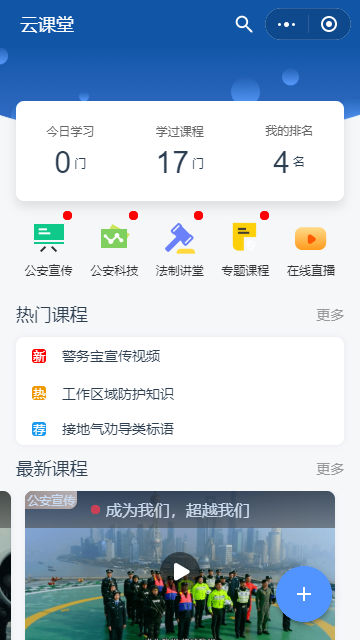

#### 二、课程分类介绍  

  

1、时政课堂：把国家和国际上的时政热点有机融入到视频课堂当中，精选时政消息，专业人士剖析讲解，可以拓展视野。
  
2、公安科技：随着互联网、大数据等现代科技与传统行业的深度融合，公安系统迎来了许许多多的公安黑科技，“一张图”全城监管，“智慧警车”全城护航，等等。公安科技的成熟，使得在家更舒心，出行更安心。 
 
3、法制讲堂：法治社会的形成，需要每一位公民的参与，做一个知法、懂法、守法的公民是每一位公民应当履行的义务。法制讲堂以形象易懂的方式，让每一位观众都能理解视频所讲的法律法规，全面普及法律意识。 
 
4、专题课程：分为防控类、打击类、综合类、民生类。  

   
 
5、在线直播：视频看完不过瘾？拿来在线直播观看名师现场指导吧。用户可开通视频直播，现场解答弹幕提问，直播录制教学视频。 
 
6、热门课程：推荐最热门的课程视频。  

7、最新视频：推荐最新的课程视频。  

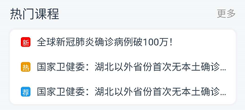 
   
#### 三、发布视频  

点击右下角的加号发布课程视频。  

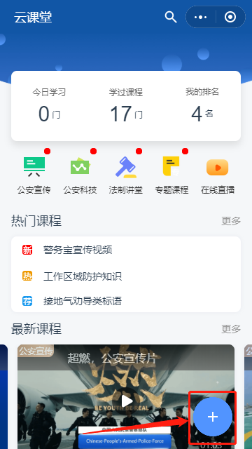  
 
填写课程标题、课程描述、责任单位，上传课程视频和课程封面，选择课程类型，发布视频。尽量详细填写课程描述，让其他用户第一时间了解课程涉及到的内容。 
   
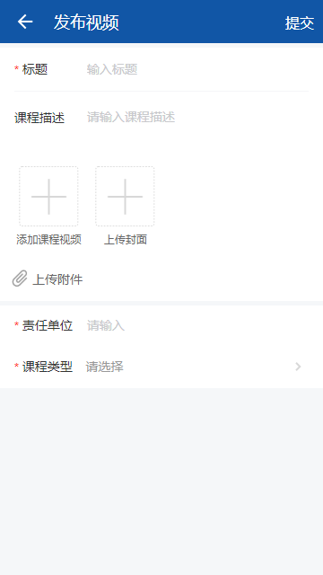 
  
#### 四、在线直播  

可支持邀请专家直播授课，授课专家在手机端，创建直播课后，即可开始直播授课。 
 
  

直播界面  

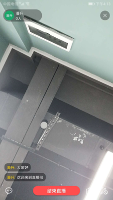

直播授课功能包括:  

1、一对多实时直播授课。授课专家对多名观众进行直播授课，延时在1—3秒之间。  

2、挂断恢复。可暂时中止直播，随时恢复，不必重建直播间。  

3、文字通讯。可直播间内以文字的方式进行通讯沟通，互动。  

4、弹幕。在直播的同时，设置弹幕，突出显示给其他观众。  

5、设置管理员。设置直播间的管理员。  

6、禁言&踢出。在直播间管理员可对某些用户禁言或者直接踢出直播间。
  
#### 五、视频播放&评论&点赞  

点进视频播放界面，上方是课堂内容播放器，下方显示视频详情。 
 
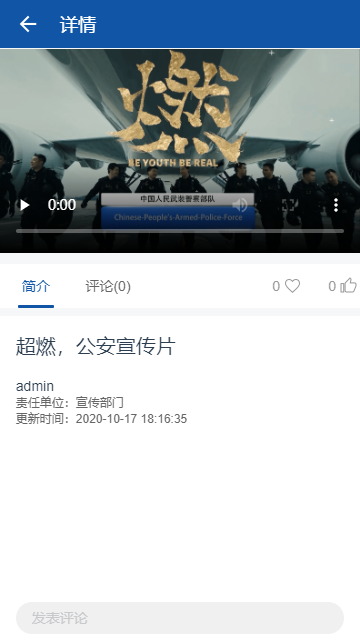  

播放器支持视频的暂停/播放/前进/后退、音量的调节、全屏播放、下载。 
 
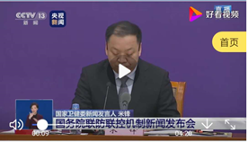  

视频简介中，显示视频标体、作者、责任单位、更新时间、视频描述。  

视频评论中，查看其他用户对该视频的评价，也可以在下方发表自己的评价。  
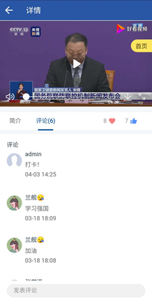  

视频中间栏的右侧，可对视频进行收藏和点赞  

  

#### 六、PC Web后端管理   
 
掌上课堂提供PC Web后端管理功能，登录成功后，如下图。
  
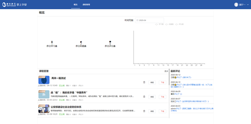 
 
1、概览：统计每日学习量/收藏量/评价量，生成每月曲线图。 
 
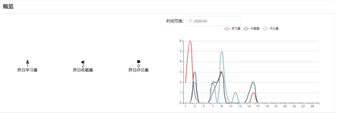  

2、每月曲线图：可根据月份来查看当月的曲线。  

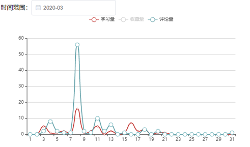  

3、最新评论：显示当时最新的评论消息。  

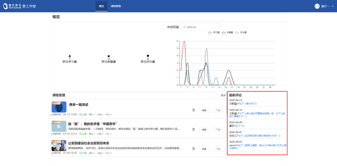  

4、课程管理：查看课程详情，新增课程，对课程进行删除/编辑/下载操作。  

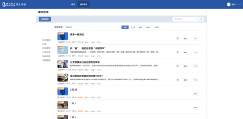  

点击课程名称可查看课程详情，获取其播放量、收藏量、评论。
  
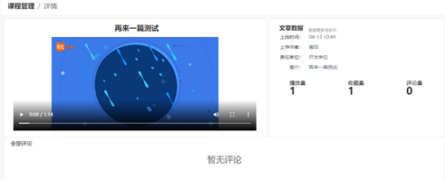  

5、新增课程：提供课程标题、责任单位，选择课程分类和课程类型（文章/视频/Pdf/PPT），按照要求上传视频封面。 
 
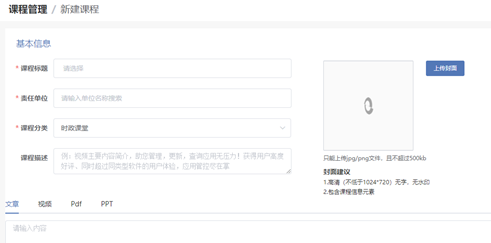  

6、课程编辑：点击编辑按钮可对课程标题、内容进行编辑。  

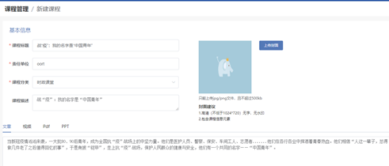  

7、定向检索：根据内容、分类（时政课堂/公安科技/法制讲堂/专题课程）、审核类型（视频/文章/PDF/PPT）、上线情况（已上线/草稿/审核中/已驳回）进行定向检索。 
 
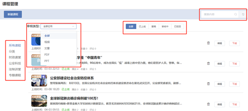  
