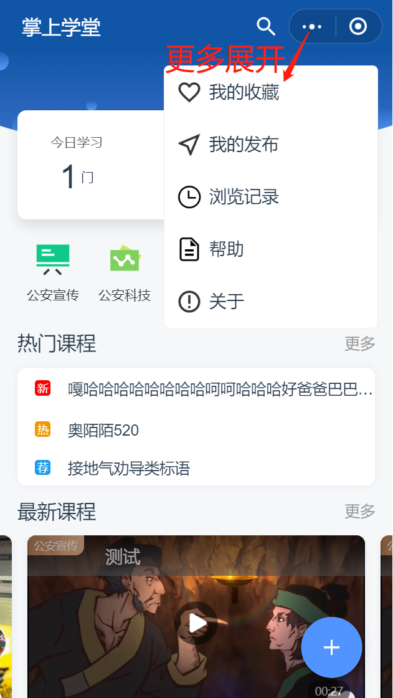

#### 开始使用

##### 应用首页

##### 我的收藏中有你收藏的视频，我的发布中可以查看你自己发布的课程，浏览记录可以看到你浏览了哪些课程，帮助中可以查看使用手册，关于可以查看版本信息

##### 新建课程
##### 1.点开首页这个蓝色的添加按钮就可以进入新建页面了

##### 2.在新建页面中填写内容，带*号的代表必填项，填写完点击提交按钮(填写中途退出可暂时保存草稿)。提交以后可以在首页中找到自己新建的课程

##### 今日所学的课程以及历史学习的课程和我的学习排名

##### 我的排名

##### 课程分类

##### 点开课程分类可进行学习，里面有这个分类的所有视频，点开观看视频到结束就算学习过这门课程，在今日学习中可以看到自己今日学习的课程，在学过的课程中可以看到历史学习过的课程，然后可以在我的排名中看到自己学过多少课程和自己的排名

##### 在课程详情里面观看视频，在评论里你可以看到别人的评论你也可以发表评论，点击爱心表示收藏，可以到我的收藏中查看

