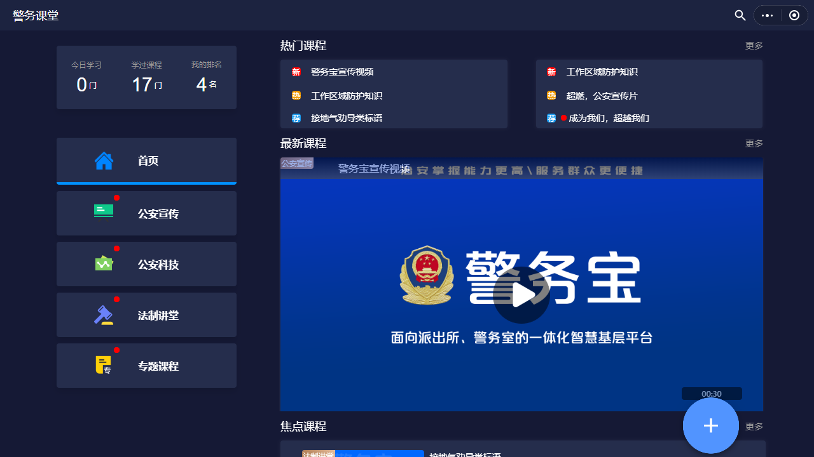
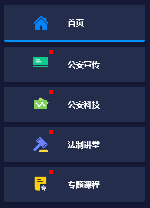
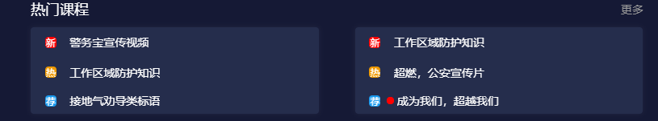
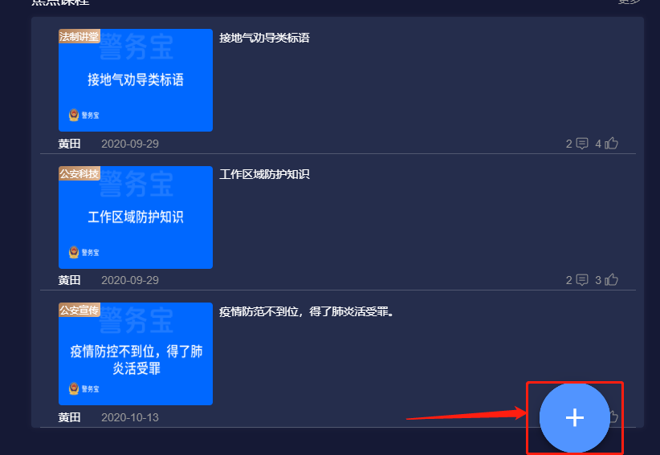
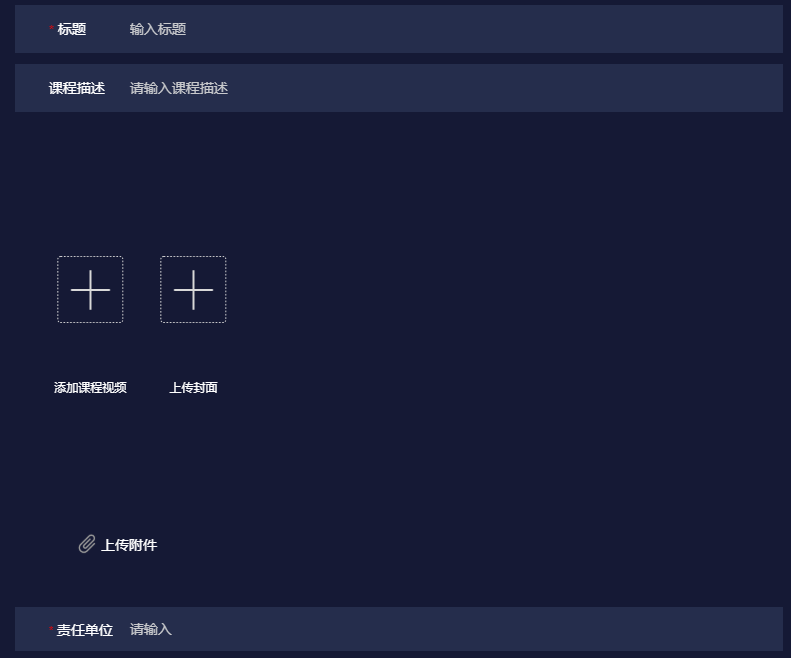
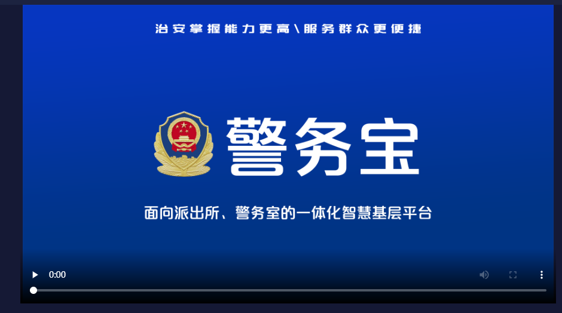
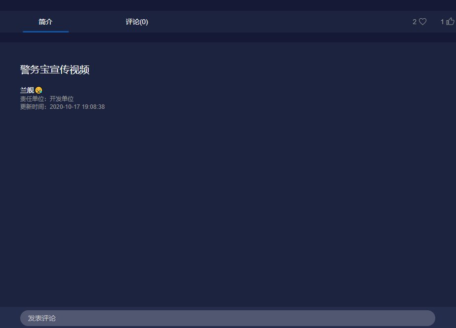
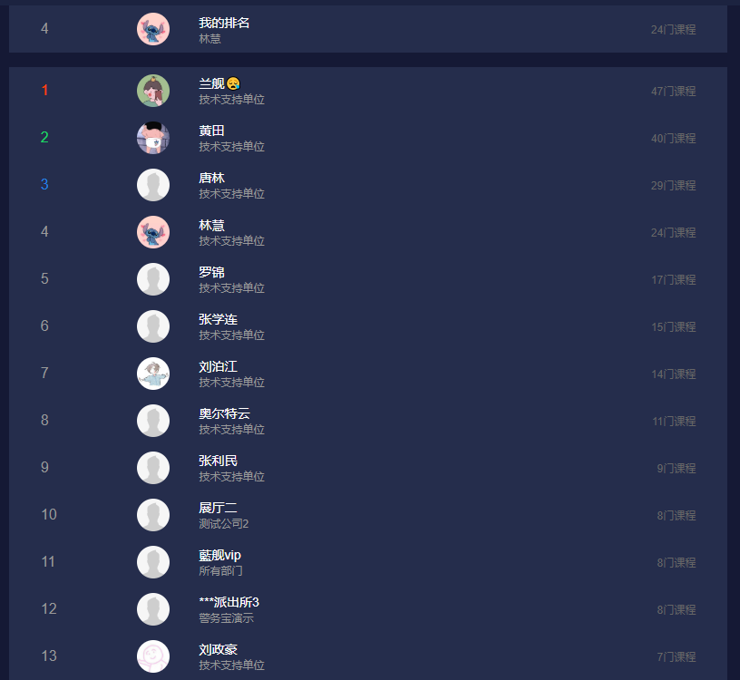
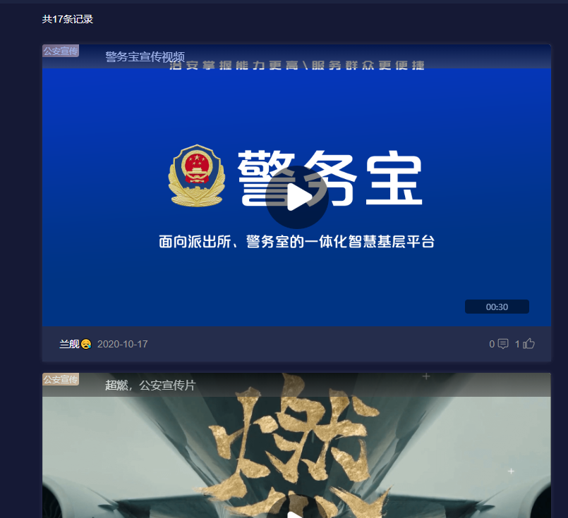

---

layout: appHelpDocsLayout

title: 云课堂

---

<ul>
   <li><a href="#home">一、掌上学堂介绍</a></li>
   <li><a href="#course_type">二、课程分类介绍</a></li>
   <li><a href="#push_course">三、发布视频</a></li>
   <li><a href="#course_play">四、视频播放&评论&点赞</a></li>
   <li><a href="#paiming">五、排名和历史学习</a></li>
</ul>

#### 一、掌上学堂介绍    
掌上学堂是一个视频学习平台，参照互联网思维倾力打造的警务内网在线实用技能学习平台，主要为学习者提供海量、优质的课程点播学习。云课堂的宗旨是，为每一位想真真正正学到些实用知识、技能的学习者，提供贴心的一站式学习服务。  
为将各单位专业技术培训视频及理论思想学习，重要会议记录视频按类别、时间、热度等收集展示，结合点赞、评论功能增强互动性。同时设有统计查看学习记录及排名展示所有用户学习“成绩”的功能，增强学习效果。便利：碎片化学习，提升工作人员业务能力。  

#### 二、课程分类介绍  

 
 
1、时政课堂：把国家和国际上的时政热点有机融入到视频课堂当中，精选时政消息，专业人士剖析讲解，可以拓展视野。  
2、公安科技：随着互联网、大数据等现代科技与传统行业的深度融合，公安系统迎来了许许多多的公安黑科技，“一张图”全城监管，“智慧警车”全城护航，等等。公安科技的成熟，使得在家更舒心，出行更安心。  
3、法制讲堂：法治社会的形成，需要每一位公民的参与，做一个知法、懂法、守法的公民是每一位公民应当履行的义务。法制讲堂以形象易懂的方式，让每一位观众都能理解视频所讲的法律法规，全面普及法律意识。  
4、专题课程：分为防控类、打击类、综合类、民生类。  

   
 
6、热门课程：推荐最热门的课程视频。  
7、最新视频：推荐最新的课程视频。  

   
 
#### 三、发布视频  

点击右下角的加号发布课程视频。  

  
 
填写课程标题、课程描述、责任单位，上传课程视频和课程封面，选择课程类型，发布视频。尽量详细填写课程描述，让其他用户第一时间了解课程涉及到的内容。
    
   

#### 四、视频播放&评论&点赞  

点进视频播放界面，上方是课堂内容播放器，下方显示视频详情。点进视频播放界面，上方是课堂内容播放器，下方显示视频详情。  

   
  
视频简介中，显示视频标体、作者、责任单位、更新时间、视频描述。  
视频评论中，查看其他用户对该视频的评价，也可以在下方发表自己的评价。
  
 
 
视频中间栏的右侧，可对视频进行收藏和点赞  

#### 五、排名和历史学习  
学过的课程会有一个排名，根据学过的课程越多排名越前

学过的课程也可以看到历史记录  

