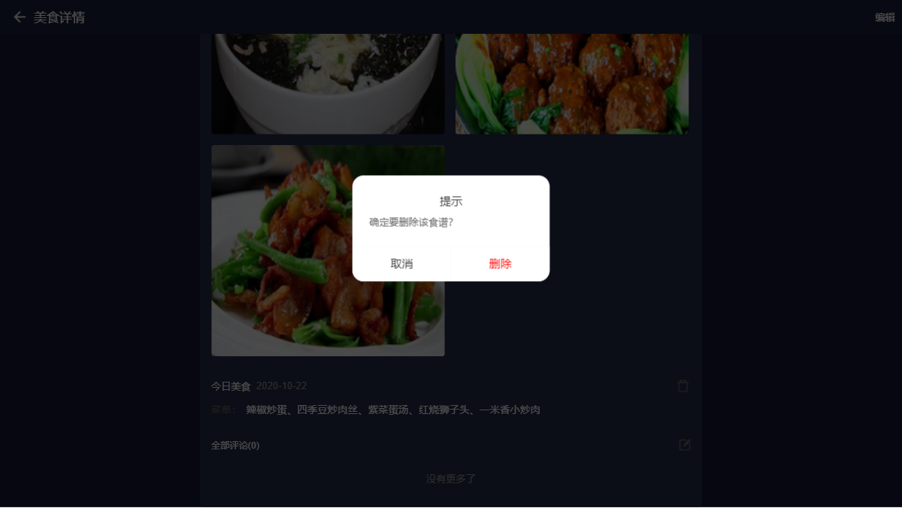

---

layout: appHelpDocsLayout

title: 每日食谱-大屏

---

#### 开始使用

* [1、应用首页](#home)
* [2、添加](#add)
* [3、详情](#detail)
* [4、更多](#more)

#### 1. 应用首页  
进入首页，顶部栏图标依次是【更多】以及【退出应用】。

首页是左右结构，左边为目录，右边为内容，点击不同的目录可以展示不同的数据内容。

如果今天没有发布美食的话，可以点击【右下图标】进入添加美食,

#### 2. 添加  
进入添加美食界面输入今天的菜单，然后再上传今天美食的照片，输入完内容可点击【右上角】进行发布。

#### 3. 详情  
可点击【图片】进行放大、左右滑动切换图片。

右上角可对该食谱进行【编辑】，点击垃圾桶小图标可以进行【删除】，也可以进行【评论】。

#### 4. 更多  
点击【左上角】可以返回首页，内容分为应用版本和开发公司相关信息。

