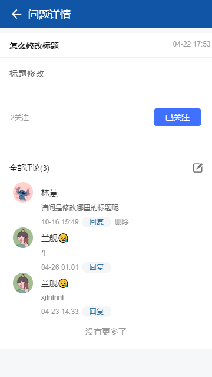

<ul>
   <li><a href="#home">一、问题反馈介绍</a></li>
   <li><a href="#index">二、首页介绍</a></li>
   <li><a href="#add">三、反馈问题</a></li>
   <li><a href="#details">四、问题详情</a></li>
   <li><a href="#pc">五、PC Web后端管理</a></li>
</ul>

#### 一、问题反馈介绍  
问题反馈是一个专门为企业开发的移动办公管理应用，用户可以使用它随时随地的查看和处理问题，同时还可以对问题进行分类并集中解决，提升项目信息化管理水平。
  

#### 二、首页介绍  

1.热门问题：如果一个问题大家关注的热度比较高，那么就会出现在热门问题列表中。  
2.我的问题：如果你反馈了问题，就可以在我的问题列表中看到了。  
3.我的关注：如果你关注了这个问题，将会在我的关注列表中看到。  
4.搜索问题：输入关键字就可以搜索到问题了。

#### 三、反馈问题  

点击右下角的加号反馈问题。  

  

填写问题标题、问题内容、问题图片，反馈问题。尽量详细填写问题描述，让其他回答者第一时间了解问题的原因涉及到的内容。

  

#### 四、问题详情  

在问题详情里面可以回答问题，当收到别人的回答以后，可以接着回复别人，讨论还有哪里不清楚的地方，你可也以点击关注这个问题，了解后续问题解决情况。 
 
  

若在pc端回答了解决方案，你也可以看到，当问题已解决你可以投已解决，未解决时可继续讨论回复。 
 
 

#### 五、PC Web后端管理  

问题反馈提供PC Web后端管理功能，登录成功后，如下图。  

 
1.问题详情:在问题详情里面可以看到问题详细解决方案，可以用图片的方式更清晰的解决问题。

 

2.回答问题：可以支持以图片，视频音频和表格的形式回答问题。

 

3.反馈统计：统计了一共提出了多少问题，有多少是已经解决的，同时有多少用户参与问题解决。  

  

4.搜索问题：可以根据你给的各种条件快速搜索到问题，比如时间、关键字，还可以根据已处理和未处理来对问题进行分类。当勾选上问题以后，点击左上角的删除可删除问题，也可以进行批量删除。

