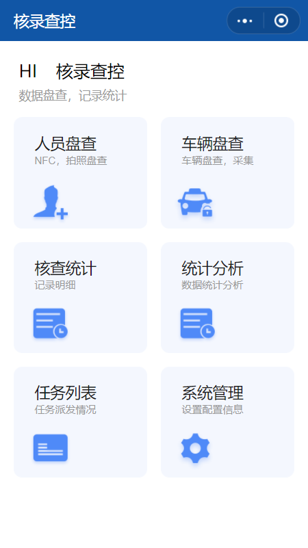
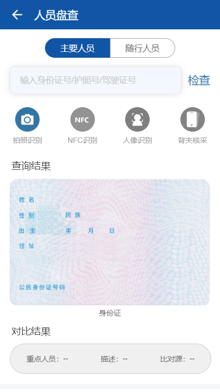
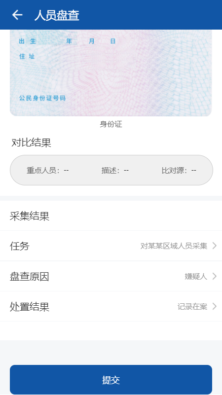
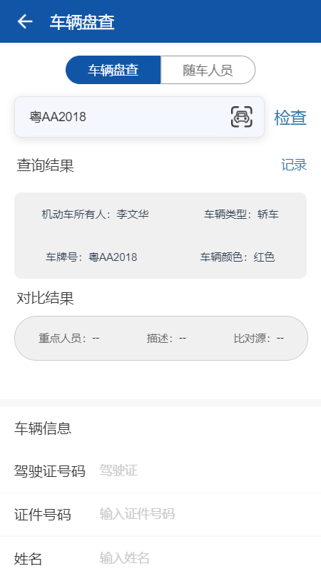
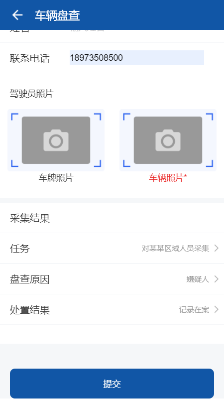
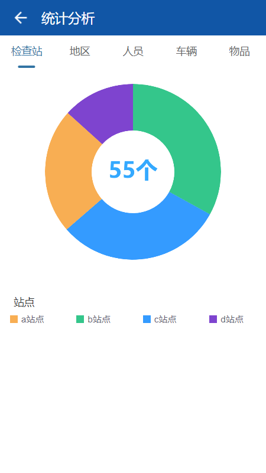
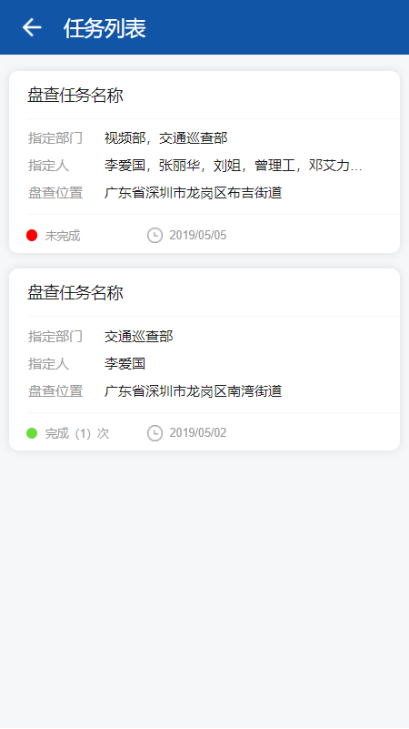
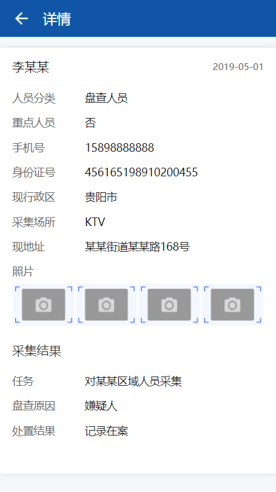
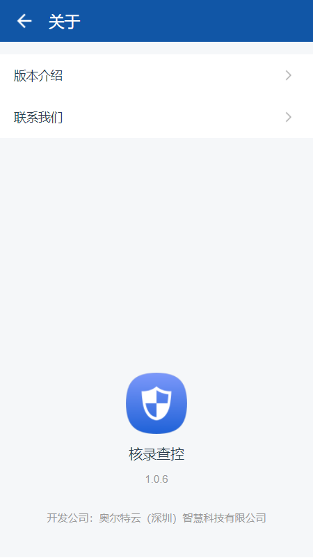

---

layout: appHelpDocsLayout

title: 核录查控

---

#### 开始使用

* [1、应用首页](#home)
* [2、详情](#detail)
* [3、更多](#more)

#### 1. 应用首页  
进入首页，顶部栏图标依次是【更多】以及【退出应用】。

首页主要分为[人员盘查](#person_check1)、[车辆盘查](#person_check2)
、[核查统计](#person_check3)、[统计分析](#person_check4)、[任务列表](#person_check5)
、[系统管理](#person_check6)六个入口。

##### 1.1 人员盘查 
输入身份证号、护照号或驾驶证号点击【检查】进行相关信息查询，也可以点击使用【拍照识别】。

##### 1.2 车辆盘查 
输入正确的车牌号点击【检查】进行相关信息查询。

##### 1.3 核查统计 
这里可以查看所有盘查过的统计人员，也可以在顶部搜索栏输入姓名、身份证进行【搜索】。

##### 1.4 统计分析 
这里可以看到各种分类的统计分析。

##### 1.5 任务列表 
所有的任务都在这显示。

##### 1.6 系统管理 
系统管理页分为【角色管理】和【站点管理】，点击可进入相关页面。

#### 2. 详情  
展示了姓名、时间、身份证号、采集场所、照片、现住址等一系列信息，点击【照片】可进行放大查看。

#### 3. 更多  
点击【左上角】可以返回首页，内容分为应用版本和开发公司相关信息。

