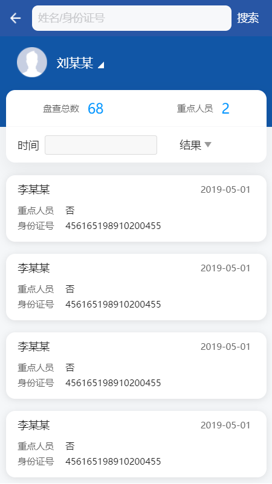

---

layout: appHelpDocsLayout

title: 核录查控

---

#### 开始使用

* [1、应用首页](#home)
* [2、详情](#detail)
* [3、更多](#more)

#### 1. 应用首页  
进入首页，导航栏图标依次是更多以及退出应用。

首页主要分为[人员盘查](#person_check1)、[车辆盘查](#person_check2)
、[核查统计](#person_check3)、[统计分析](#person_check4)、[任务列表](#person_check5)
、[系统管理](#person_check6)六个入口。

##### 1.1 人员盘查 
输入身份证号、护照号或驾驶证号进行检查，也可以使用拍照识别。

##### 1.2 车辆盘查 
输入正确的车牌号点击检查可进行查询相关信息。

##### 1.3 核查统计 
这里可以看到自己上报的所有警情。

##### 1.4 统计分析 
这里可以看到各种分类的统计分析。

##### 1.5 任务列表 
所有的任务都在这显示。

##### 1.6 系统管理 
这里可以看到各种分类的统计分析。

#### 2. 详情  
展示了姓名、时间、身份证号、采集场所、照片、现住址等一系列信息，照片点击可进行放大。

#### 3. 更多  
左上角可以返回首页，内容分为应用版本及开发公司相关信息。

