---

layout: appHelpDocsLayout

title: 核录查控-大屏

---

#### 开始使用

* [1、应用首页](#home)
* [2、系统管理](#system_management)
* [3、详情](#detail)
* [4、更多](#more)

#### 1. 应用首页  
进入首页，顶部栏图标依次是【更多】以及【退出应用】。

点击【右下图标】可选择点击进入[人员](#person_check1)或[车辆](#person_check2)盘查,首页是左右结构，中间部分是目录列表，当你点击不同的目录，右边就会展示不同的内容列表。底部左边是一个按不同类型显示总人数的饼图。

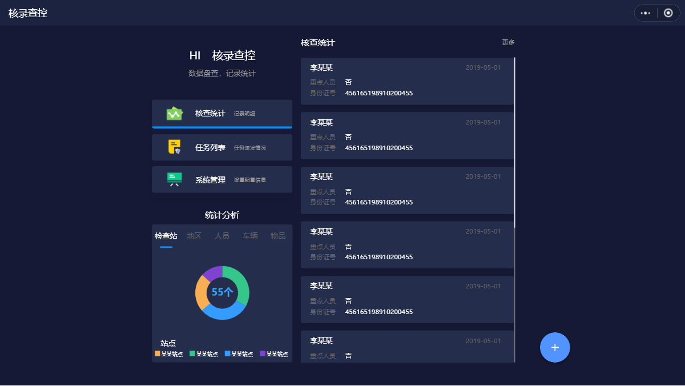

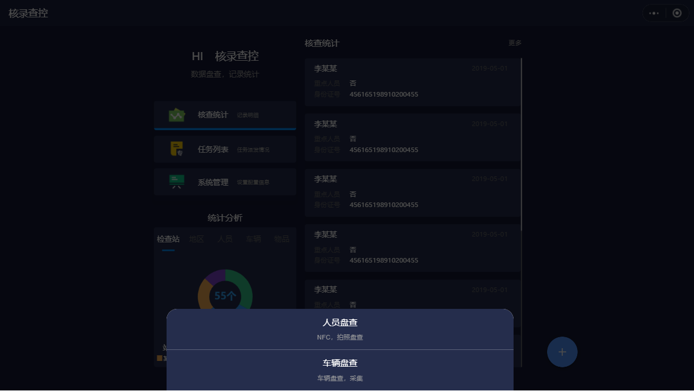
##### 1.1 人员盘查 
输入身份证号、护照号或驾驶证号点击【检查】进行相关信息查询，也可以点击使用【拍照识别】，内容输入完毕可在底部点击【提交】。

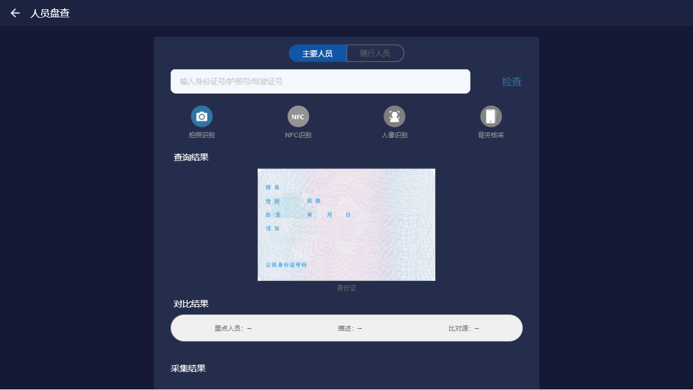

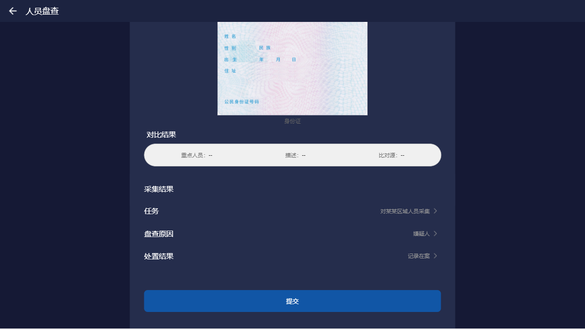
##### 1.2 车辆盘查 
输入正确的车牌号点击【检查】进行相关信息查询，内容输入完毕可在底部点击【提交】。

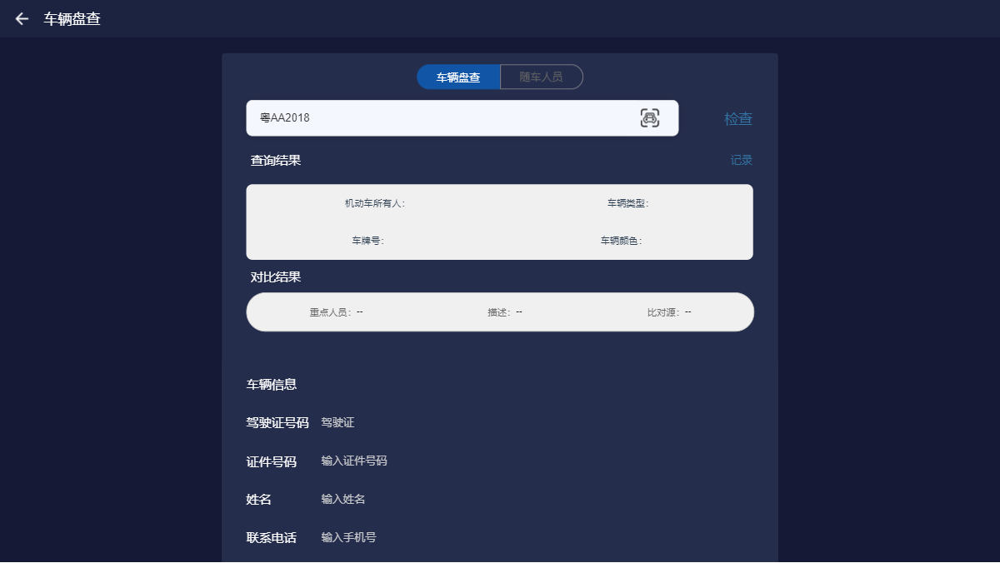

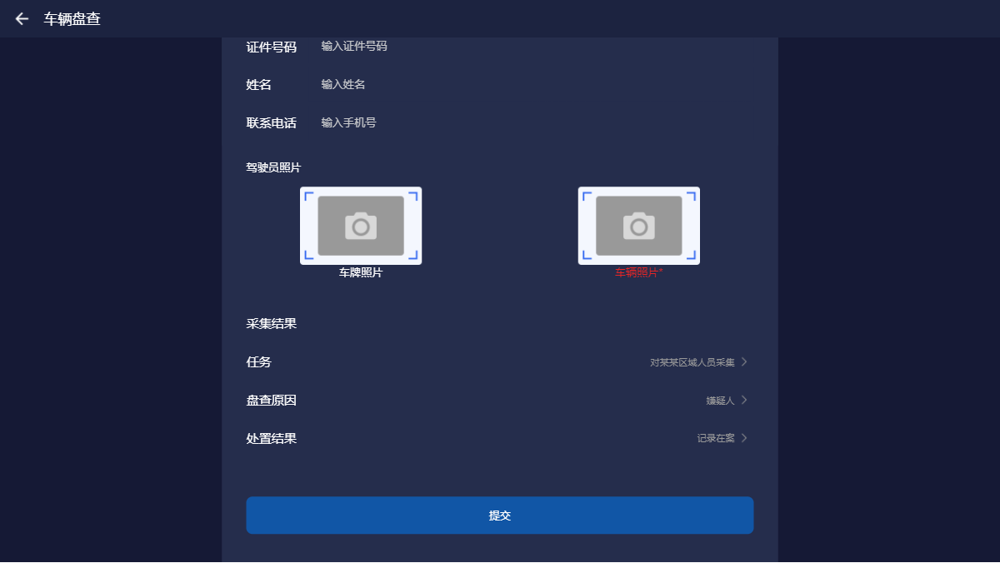

##### 1.3 核查统计 
首页列表点击更多可进入，该页面可以查看所有盘查过的统计人员，也可以在顶部搜索栏输入姓名、身份证进行【搜索】。

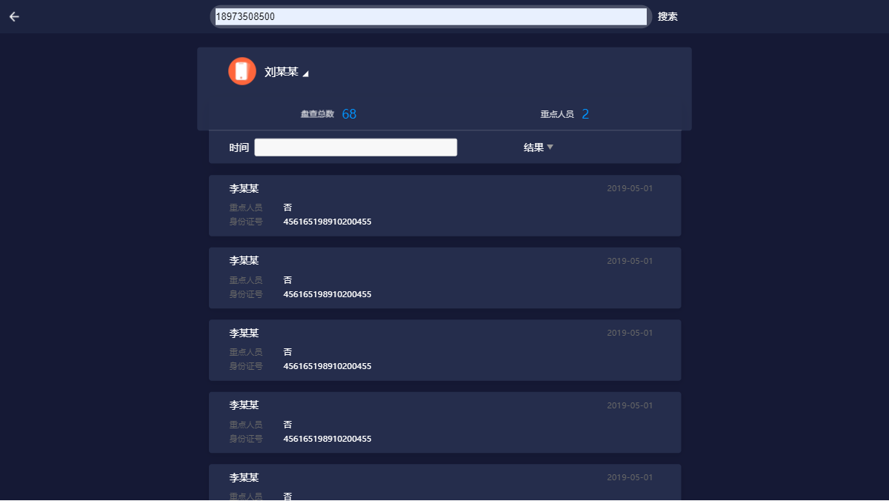

##### 1.4 任务列表 
所有的任务都在这显示。

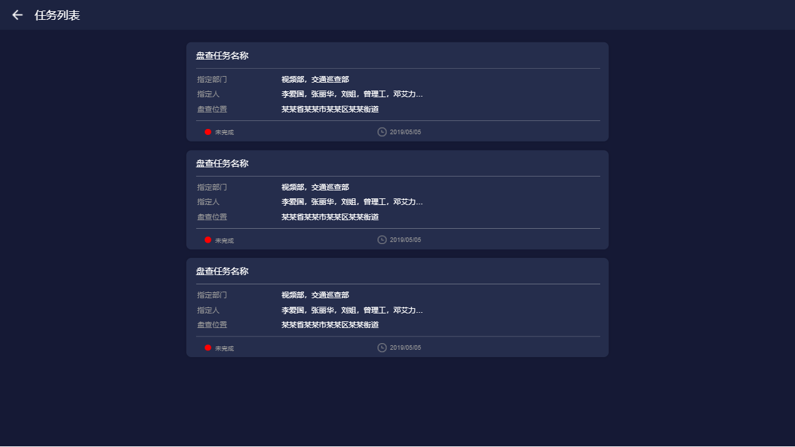

##### 2. 系统管理 
系统管理页分为【角色管理】和【站点管理】，点击可进入相关页面。

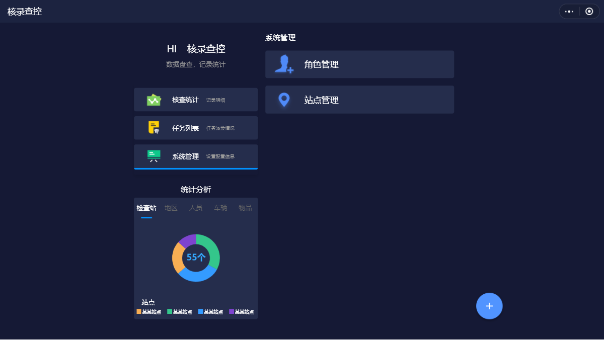

#### 3. 详情  
展示了姓名、时间、身份证号、采集场所、照片、现住址等一系列信息，点击【照片】可进行放大查看。

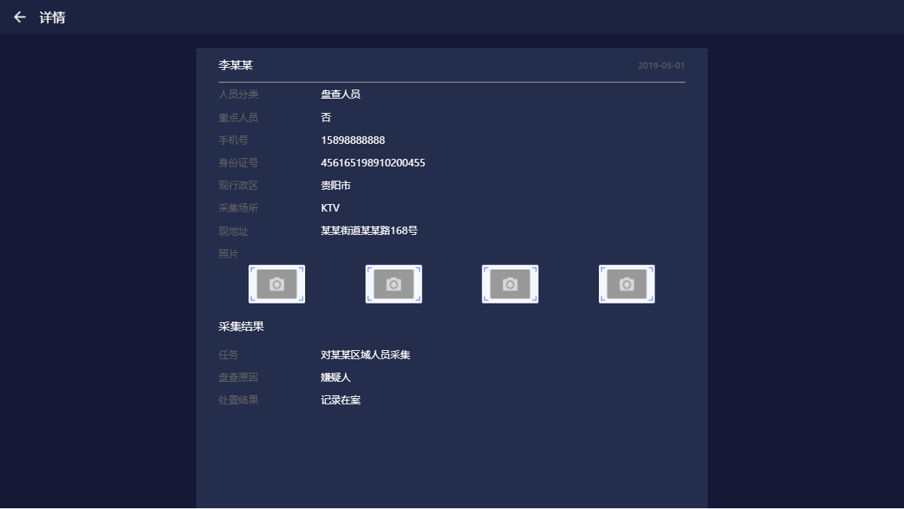

#### 4. 更多  
点击【左上角】可以返回首页，内容分为应用版本和开发公司相关信息。

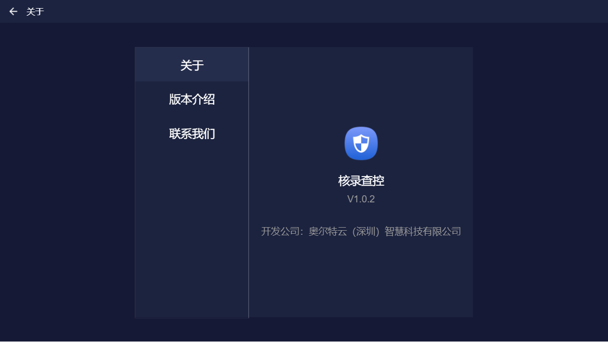
