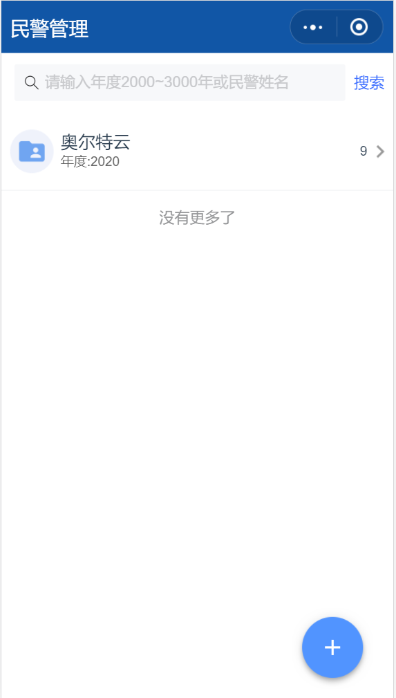
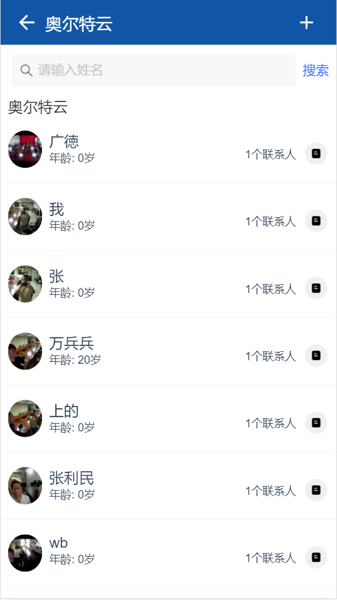
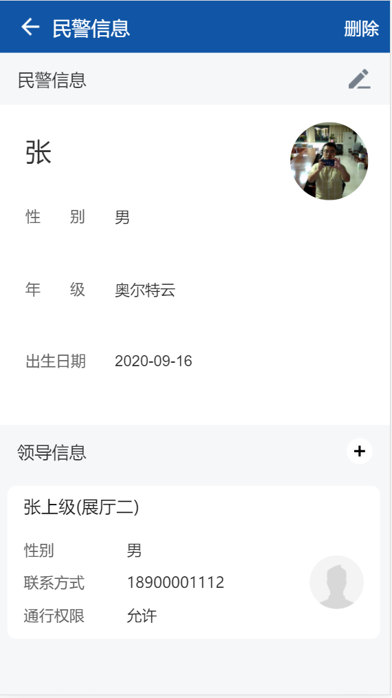
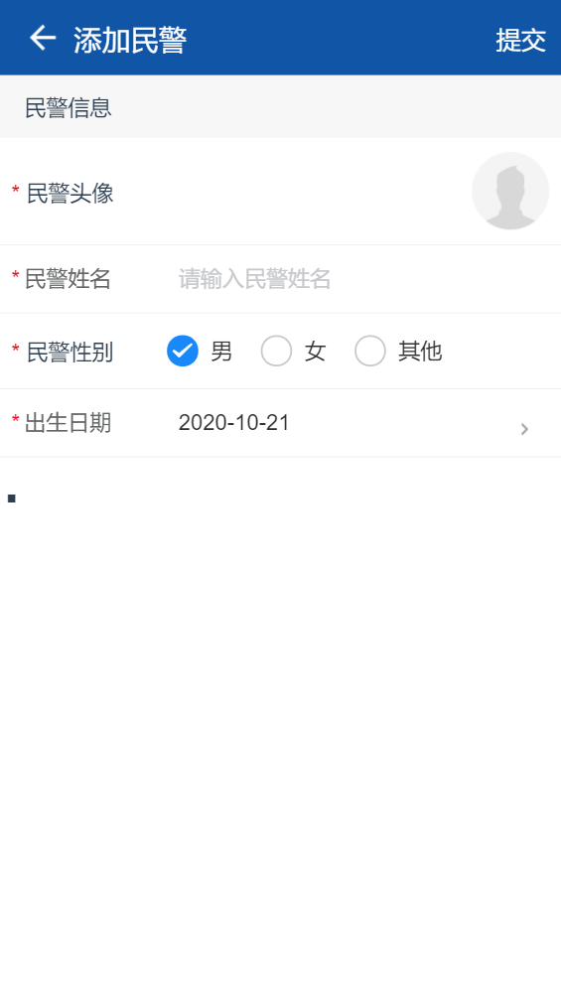
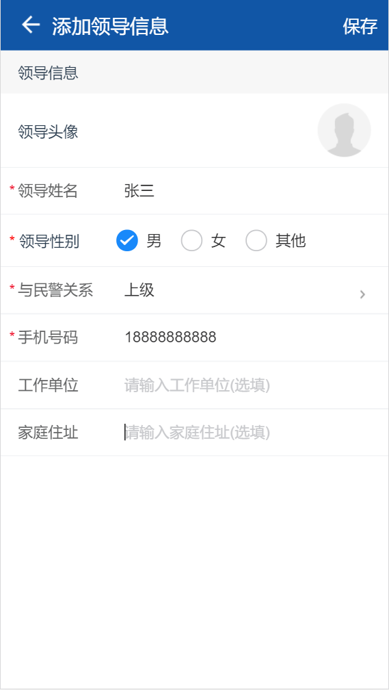
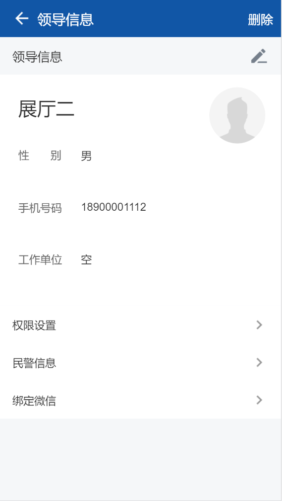
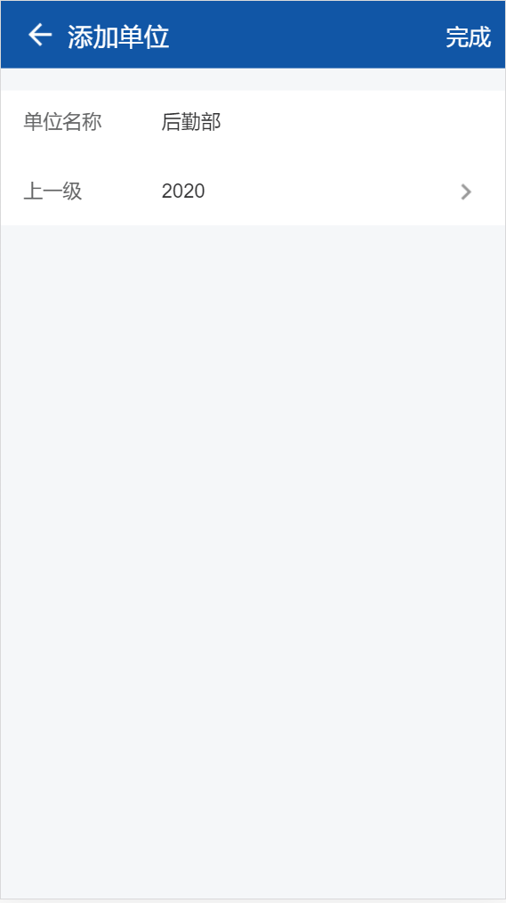
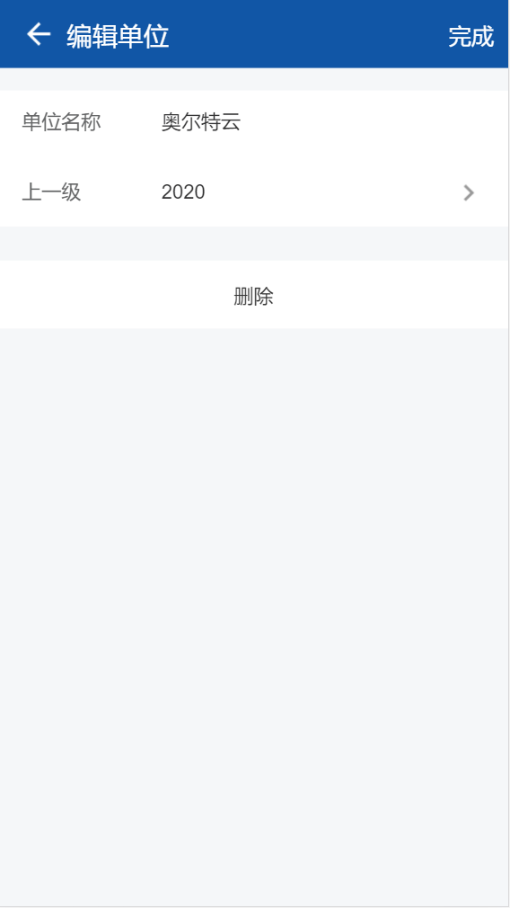

---

layout: appHelpDocsLayout

title: 民警管理

---
<ul>
   <li><a href="#home">1.首页</a></li>
   <li><a href="#list">2.民警列表</a></li>
   <li><a href="#policeInfo">3.民警信息</a></li>
   <li><a href="#add_mj">4.添加民警信息</a></li>
   <li><a href="#edit_mj">5.修改民警信息</a></li>
   <li><a href="#add_ld">6.添加领导信息</a></li>
   <li><a href="#ld_info">7.领导信息</a></li>
   <li><a href="#edit_dw">8.添加/修改单位</a></li>
</ul>

### 1.首页

民警管理首页展示的是单位列表，点击右下角按钮可以<a href="#edit_dw">添加单位</a>。搜索框可以输入年份或者姓名进行搜索

### 2.民警列表

列表展示是单位中所有的民警，右上角按钮可以<a href="#add_mj">添加民警</a>和<a href="#edit_dw">编辑单位</a>。点击民警可查看详情，点击民警右侧按钮可拨打电话或发送短信。 搜索框可搜索单位内民警

### 3.民警信息

民警信息展示 民警以及<a href="#ld_info">领导信息</a>，可删除民警或者<a href="#edit_mj">修改民警</a>也可以<a href="#add_ld">添加领导</a>

### 4.添加民警信息

* 为必填项,出生日期不能晚于当前日期

### 5.修改民警信息

### 6.添加领导

* 为必填项,手机号必须为11位数字

### 7.领导信息

### 8.添加/修改单位

#### 8.1添加单位
输入单位名称选择年份后，点击右上角按钮完成添加。

 

#### 8.2修改单位
单位内民警不为空无法删除单位。

