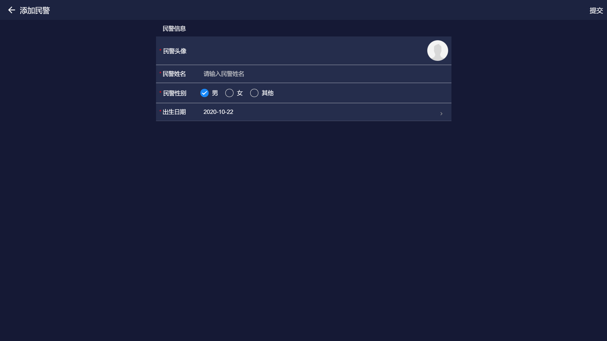

---

layout: appHelpDocsLayout

title: 民警管理

---
<ul>
   <li><a href="#home">1.首页</a></li>
   <li><a href="#policeInfo">2.民警信息</a></li>
   <li><a href="#add_mj">3.添加民警信息</a></li>
   <li><a href="#edit_mj">4.修改民警信息</a></li>
   <li><a href="#add_ld">5.添加领导信息</a></li>
   <li><a href="#ld_info">6.领导信息</a></li>
   <li><a href="#ld_info">7.修改领导信息</a></li>
   <li><a href="#edit_dw">8.添加/修改单位</a></li>
</ul>

### 1.首页

首页左侧展示单位列表右侧展示单位内员工列表，右侧内容会根据左侧点击的单位产生变化。点击右下角按钮可<a href="#edit_dw">添加单位</a>，点击右上角加号按钮可<a href="#add_mj">添加民警</a>或<a href="#edit_dw">编辑单位</a>。

### 2.民警信息

民警信息展民警信息以及<a href="#ld_info">领导信息</a>，点击右上角按钮可删除民警、点击民警信息卡片右侧按钮可<a href="#edit_mj">修改民警、</a>也可以点击领导信息卡片右侧添加按钮<a href="#add_ld">添加领导</a>。

### 3.添加民警信息

* 为必填项，出生日期不能晚于当前日期。

### 4.修改民警信息

修改数据后点击右上角按钮保存修改。

### 5.添加领导

*&nbsp;为必填项,手机号必须为11位数字。

### 6.领导信息

点击卡片右上角可以<a href="#edit_ld">修改领导信息</a>，点击右上角按钮可删除领导。

### 7.修改领导信息

修改数据后点击右上角按钮保存修改。

### 8.添加/修改单位

#### 8.1添加单位
输入单位名称选择年份后，点击右上角按钮完成添加。

 

#### 8.2修改单位
单位内民警不为空无法删除单位。

