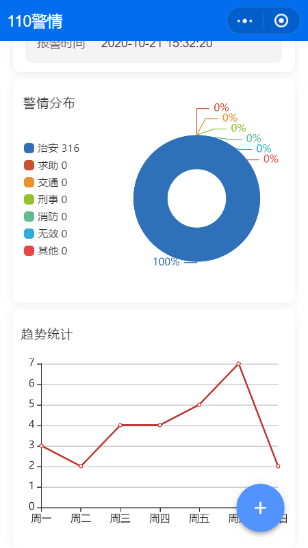
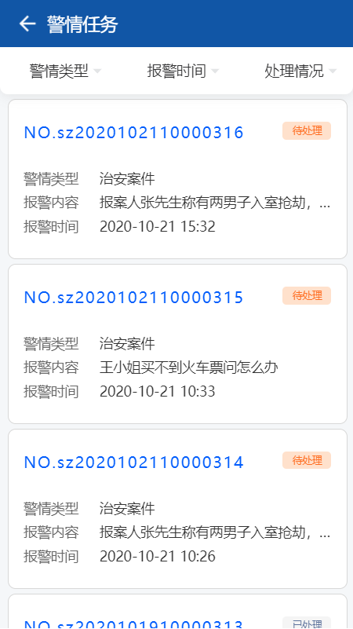
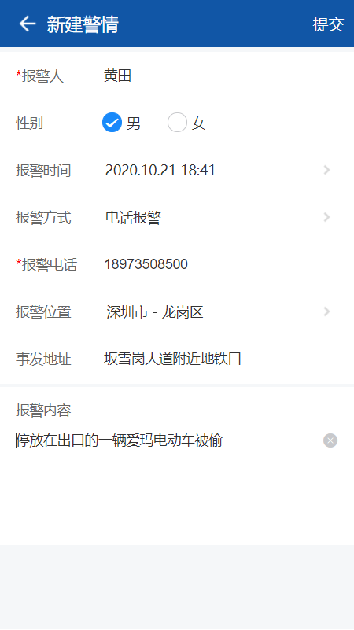
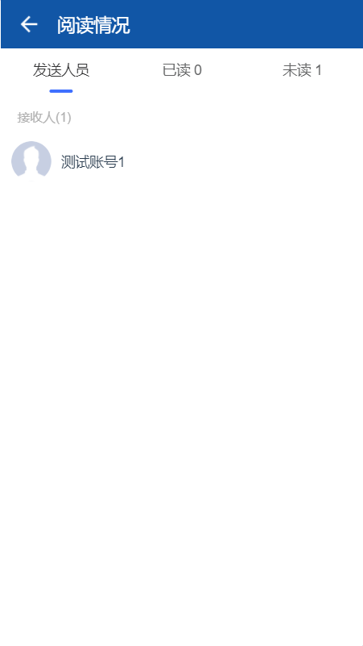

---

layout: appHelpDocsLayout

title: 110警情

---

#### 开始使用 

* [1、应用首页](#home)
* [2、更多](#more)
* [3、新建](#add)
* [4、详情](#detail)

#### 1. 应用首页  
进入首页，导航栏图标依次是更多以及退出应用，
右下图标进入新建警情。

##### 1.1 警情任务

##### 1.2 累计警情

##### 1.3 我的上报

#### 2. 更多  
右上角可以返回首页，内容分为应用版本及开发公司相关信息。

#### 3. 新建  

进入新建界面输入内容，填写姓名、选择性别、时间等信息，输入完内容可点击右上角进行提交。

#### 4. 详情  
点击图片可以放大查看，点击附件可以进行下载。最底部可对该汇报进行评论等相关操作。（可对草稿进行内容编辑）

点击阅读人数可查看发送、已读、未读人员情况。

