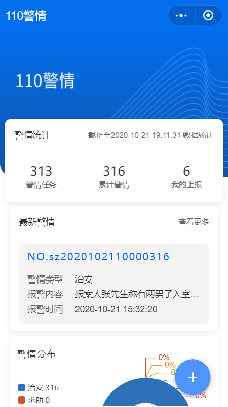
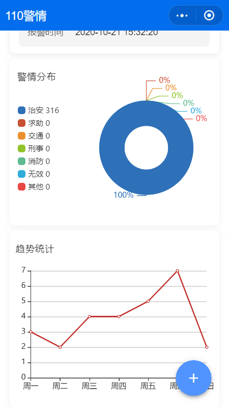
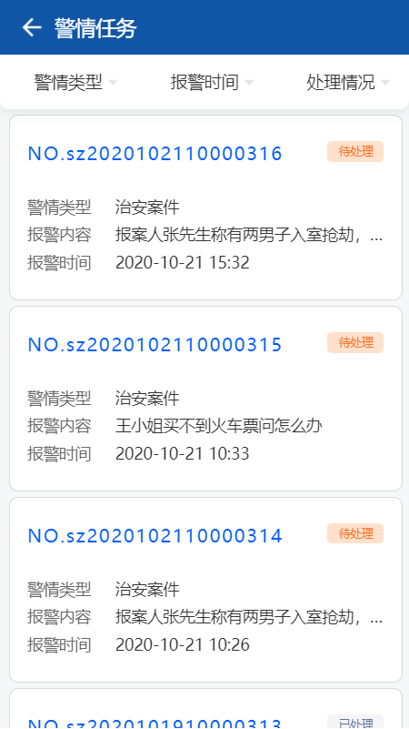
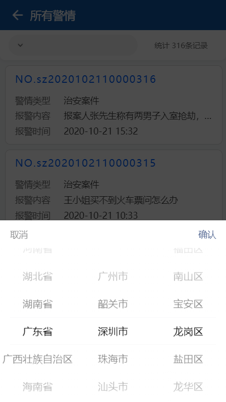
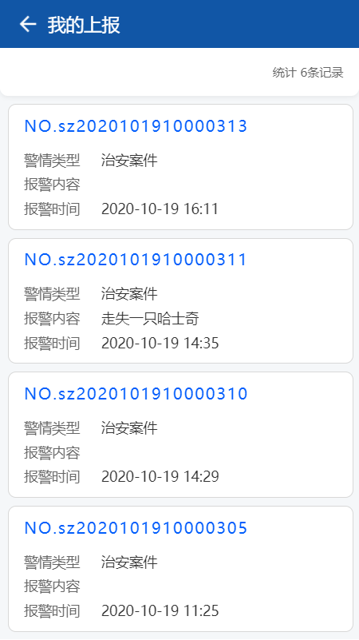
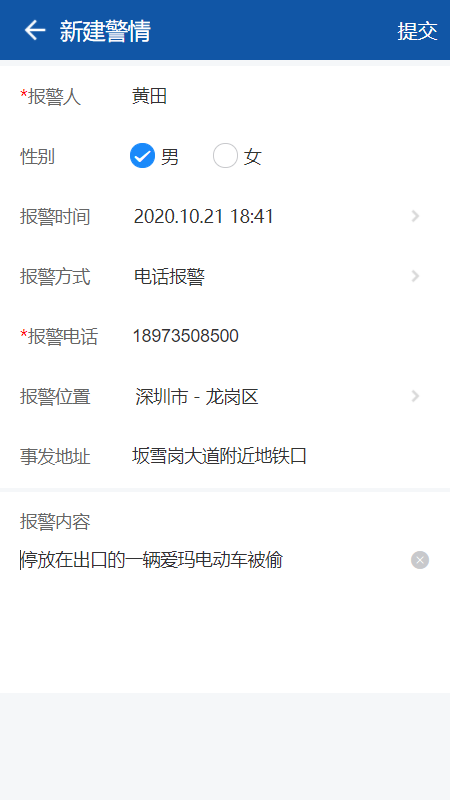
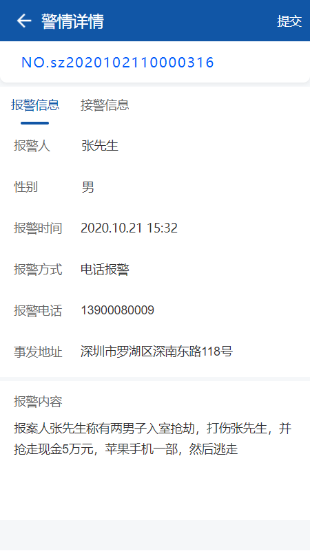
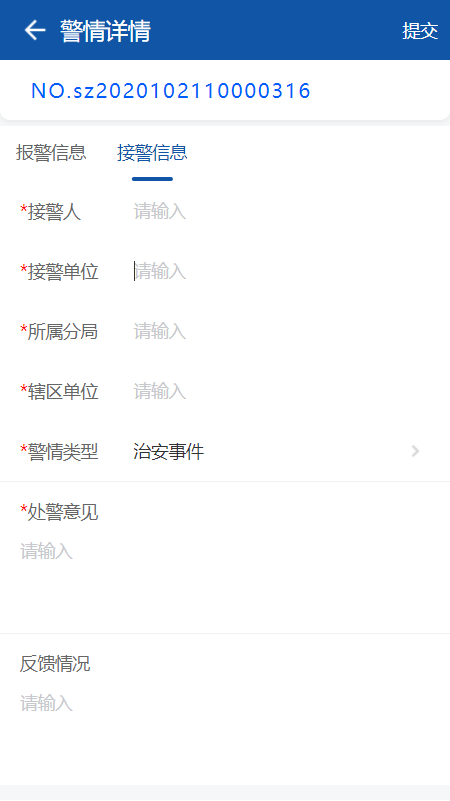
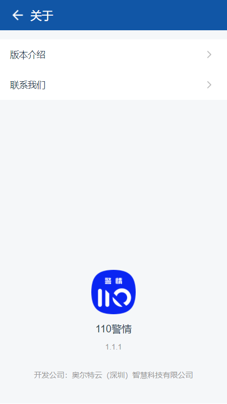

---

layout: appHelpDocsLayout

title: 110警情

---

#### 开始使用 

* [1、应用首页](#home)
* [2、新建](#add)
* [3、详情](#detail)
* [4、更多](#more)

#### 1. 应用首页  
进入首页，导航栏图标依次是更多以及退出应用。

右下图标进入新建警情。

首页主要分为[警情任务](#police_task)、[累计警情](#all_police_situation)
、[我的上报](#my_report)三个入口。

##### 1.1 警情任务 
所有的警情任务信息都这里，你也可以根据警情类型、报警时间、处理情况进行精确查询。

##### 1.2 累计警情 
所有上报的警情信息都这里，你也可以根据地区进行相应的查询。

##### 1.3 我的上报 
这里可以看到自己上报的所有警情。

#### 2. 新建  
进入新建界面输入内容，填写姓名、选择性别、时间、电话等信息，输入完内容可点击右上角进行提交。

#### 3. 详情  
警情详情分为报警信息和接警信息，
报警信息是报警人填写的一些相关信息。

接警信息是由对应的民警将其填写并进行提交。

#### 4. 更多  
左上角可以返回首页，内容分为应用版本及开发公司相关信息。

