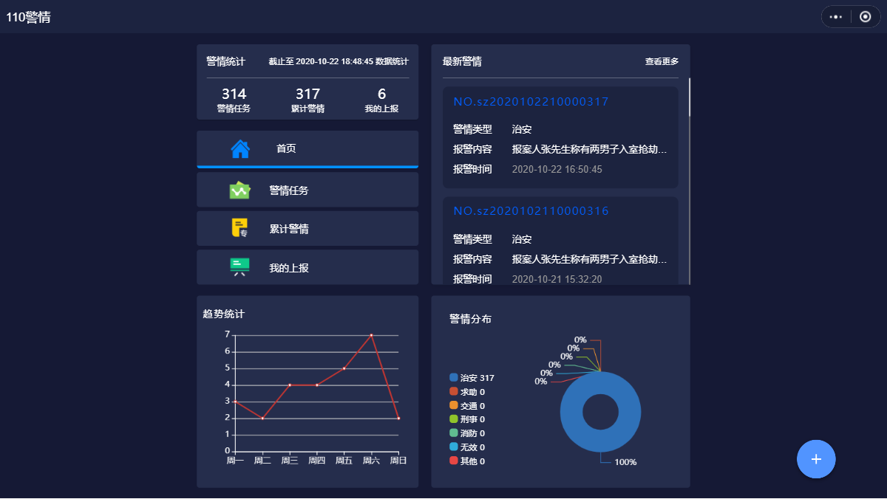
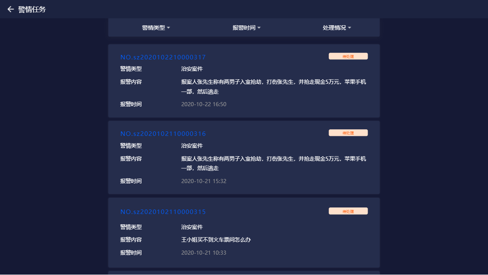
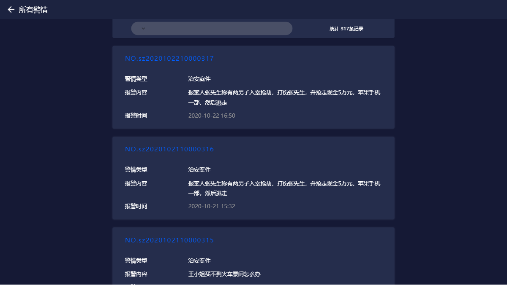
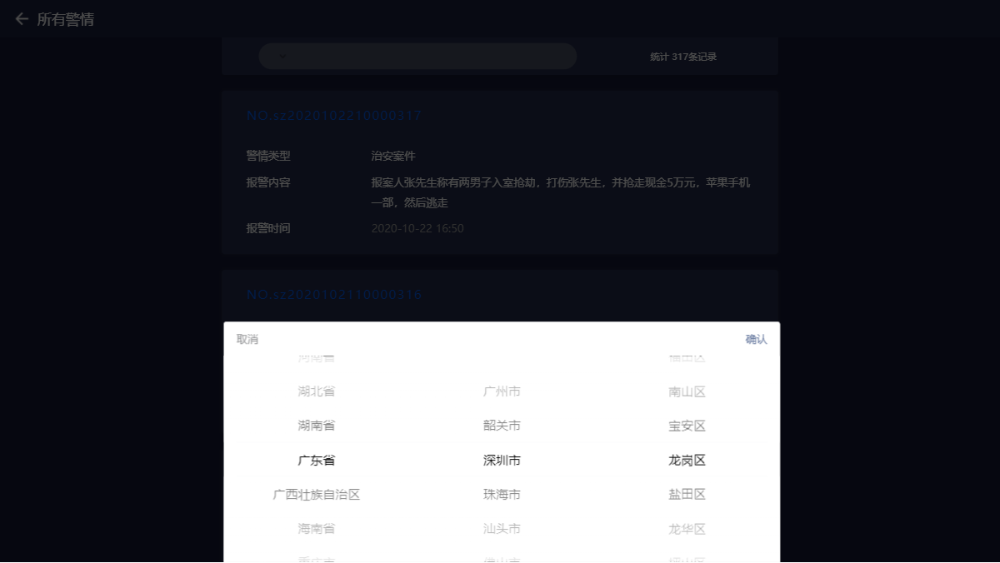
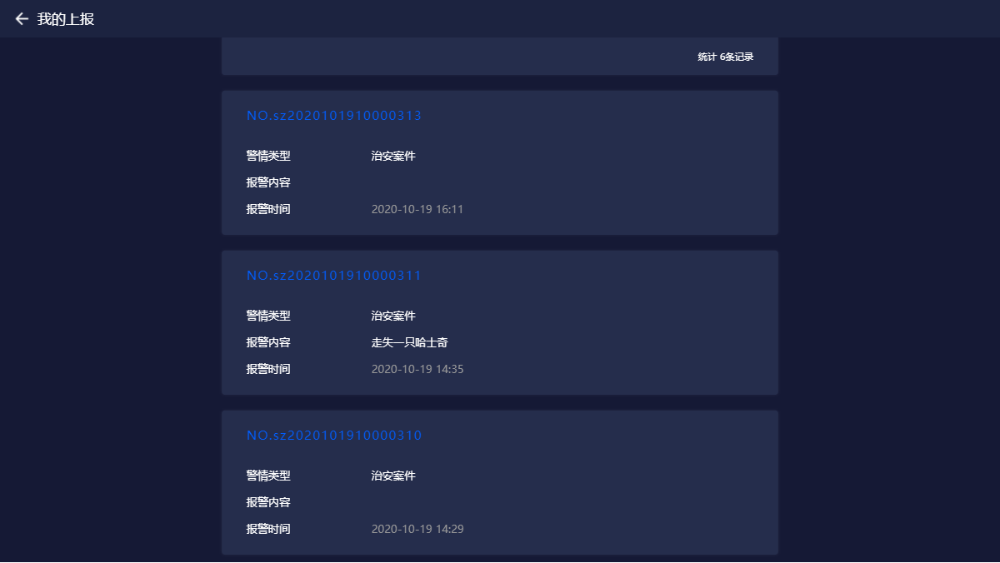
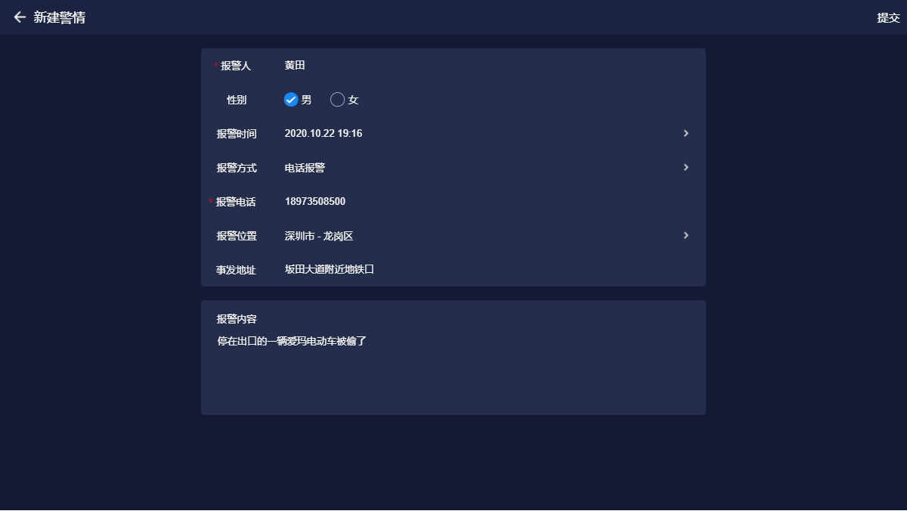
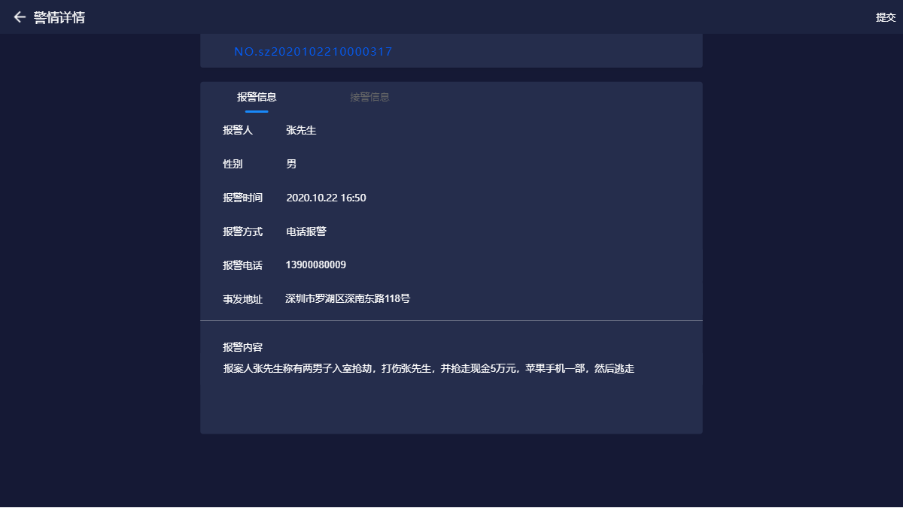
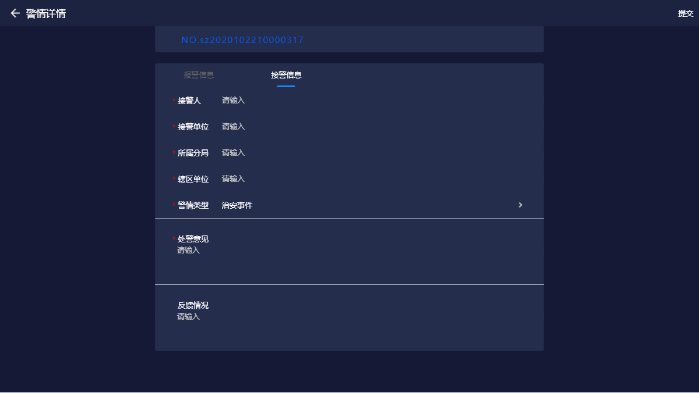
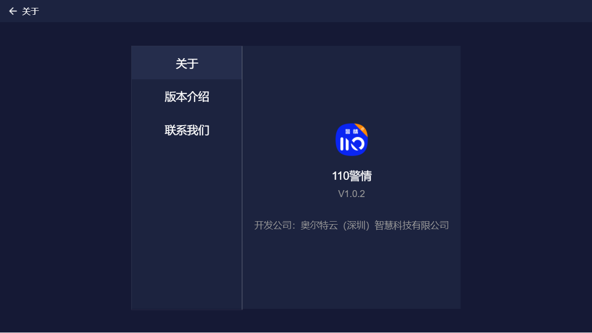

---

layout: appHelpDocsLayout

title: 110警情-大屏

---

#### 开始使用 

* [1、应用首页](#home)
* [2、新建](#add)
* [3、详情](#detail)
* [4、更多](#more)

#### 1. 应用首页  
进入首页，顶部栏图标依次是【更多】以及【退出应用】。

点击【右下图标】进入新建警情,首页是左右结构，左边最上部分是警情数据的一个统计总和，中间部分是目录列表，当你点击不同的目录，右边就会展示不同的内容列表。底部左边是一个折线趋势统计图，记录着一周的警情上报的情况。右边是一个按警情类型显示总数据的饼图。

##### 1.1 警情任务 
所有的警情任务信息都这里，当内容过多时，你也可以选择【警情类型】、【报警时间】、【处理情况】进行精确查询。

##### 1.2 累计警情 
所有上报的警情信息都这里，当内容过多时，你可以【点击顶部图标】选择地区进行相应的查询。

##### 1.3 我的上报 
这里可以看到自己上报过的所有警情。

#### 2. 新建  
进入新建界面输入内容，填写姓名、选择性别、时间、电话等信息，输入完内容可点击【右上角】进行提交。

#### 3. 详情  
警情详情分为报警信息和接警信息，
报警信息是报警人填写的一些相关信息。

接警信息是由对应的民警将其填写并进行【提交】。

#### 4. 更多  
点击【左上角】可以返回首页，内容分为应用版本和开发公司相关信息。

