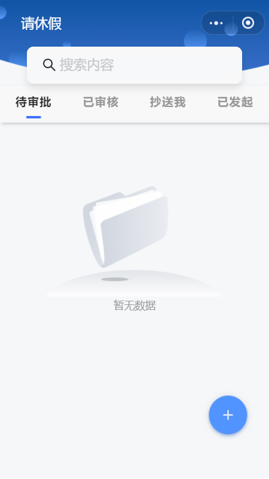
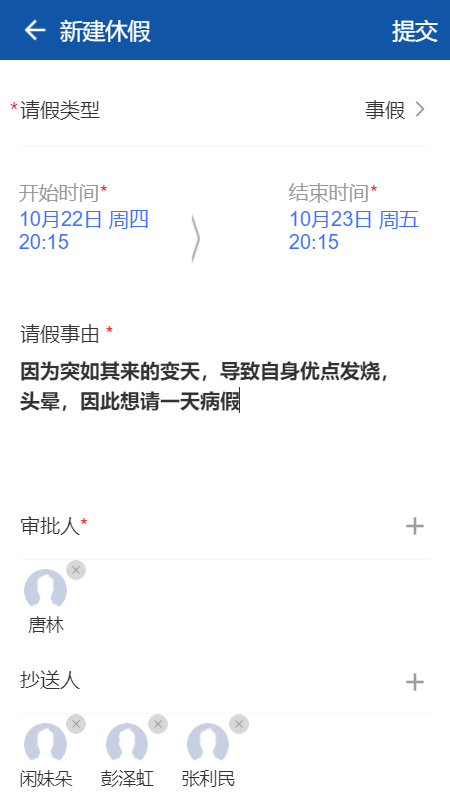
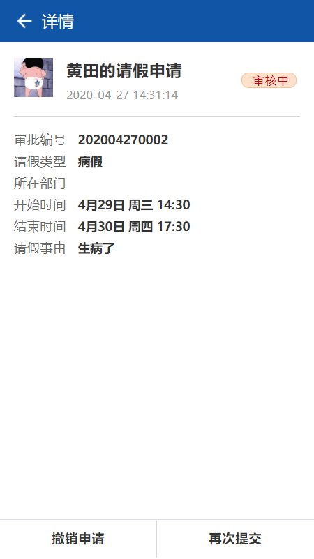
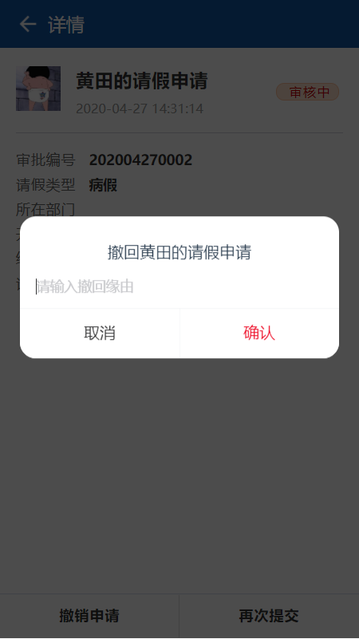
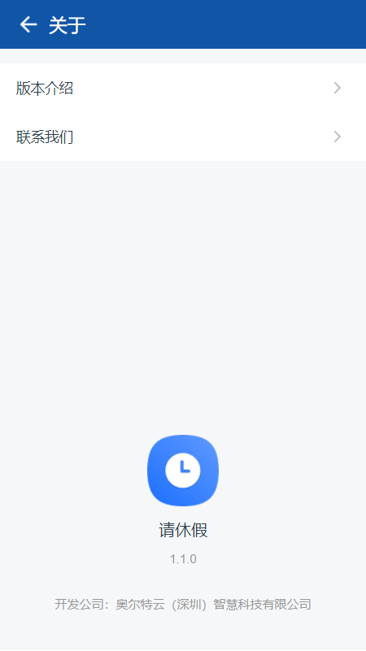

---

layout: appHelpDocsLayout

title: 请休假

---
#### 开始使用

* [1、应用首页](#home)
* [2、新建](#add)
* [3、详情](#detail)
* [4、更多](#more)

#### 1. 应用首页  
进入首页，顶部栏图标依次是【更多】以及【退出应用】，在首页新建请休假以后，等待领导审批。

* 【待审批】表示你还有没有别人的请休假申请没有审批。
* 【已审核】表示已审批别人的请休假申请，
* 【抄送我】可以查看到别人的请休假但是不需要你你做出审批，
* 【我发起】可以查看到我们自己的请休假的申请信息。

#### 2. 新建  
进入新建界面选择请假类型，输入请假事由、时间，选择审批人等信息，输入完内容可点击【右上角】进行提交。

#### 3. 详情
如果一直都处于审核中，也可以点击底部按钮进行【撤销申请】和【再次提交】。（该按钮只在审核中状态存在）

#### 4. 更多  
点击【左上角】可以返回首页，内容分为应用版本和开发公司相关信息。

