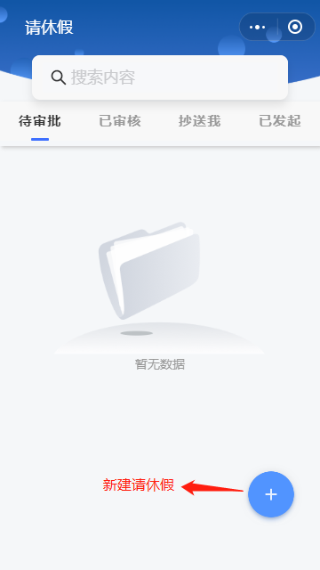
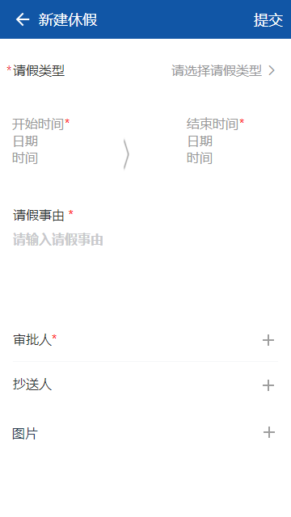
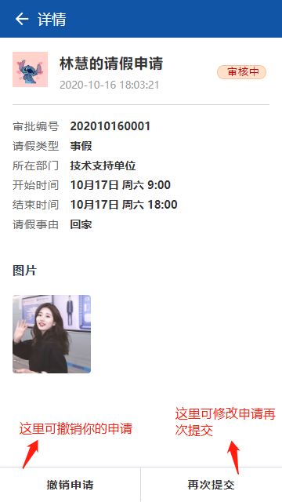

---

layout: appHelpDocsLayout

title: 请休假

---
#### 开始使用
##### 在首页里面新建请休假以后，等待领导审批。
#####待审批表示你还有没有别人的请休假申请没有审批，已审核表示已审批别人的请休假申请，抄送我可以查看到别人的请休假但是不需要你你做出审批，我们自己的请休假申请可以在我发起里面查看到。

##### 请休假申请

##### 审批详情

