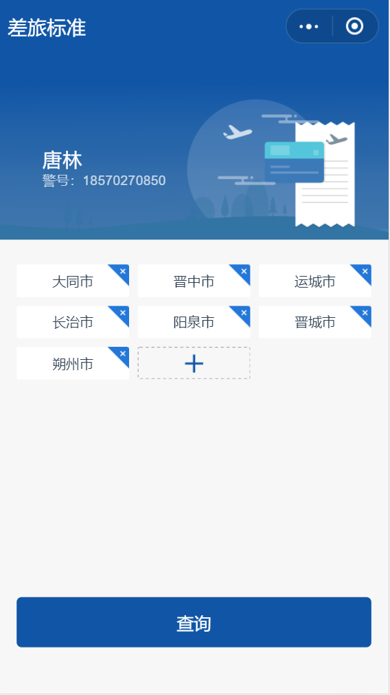
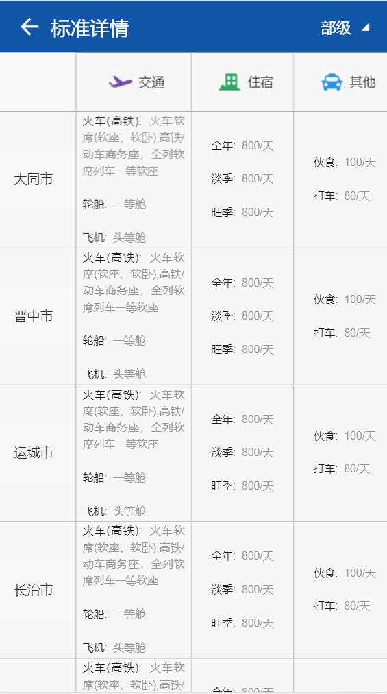
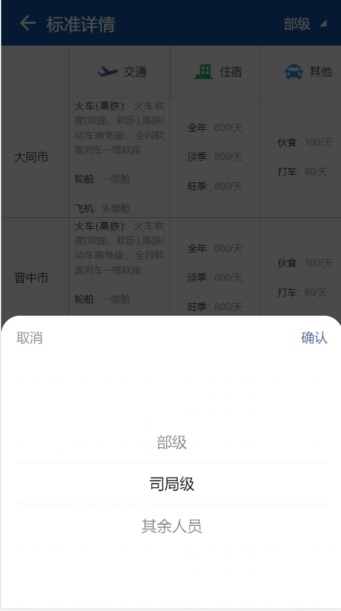
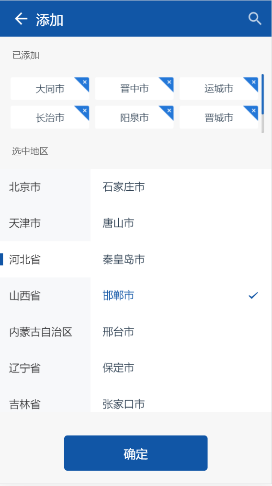

---

layout: appHelpDocsLayout

title: 差旅标准

---
<ul>
   <li><a href="#home">1.应用首页</a></li>
   <li><a href="#list">2.标准详情</a></li>
   <li><a href="#add">3.添加</a></li>
</ul>

##### 应用首页 

点击添加按钮可添加城市标准，也可以在列表中删除城市。点击查询按钮查询已添加城市的标准

##### 标准详情 

展示已添加的城市的标准表

 

点击右上角按钮可切换级别

##### 添加 

添加城市可多选，点击确认按钮后返回首页

