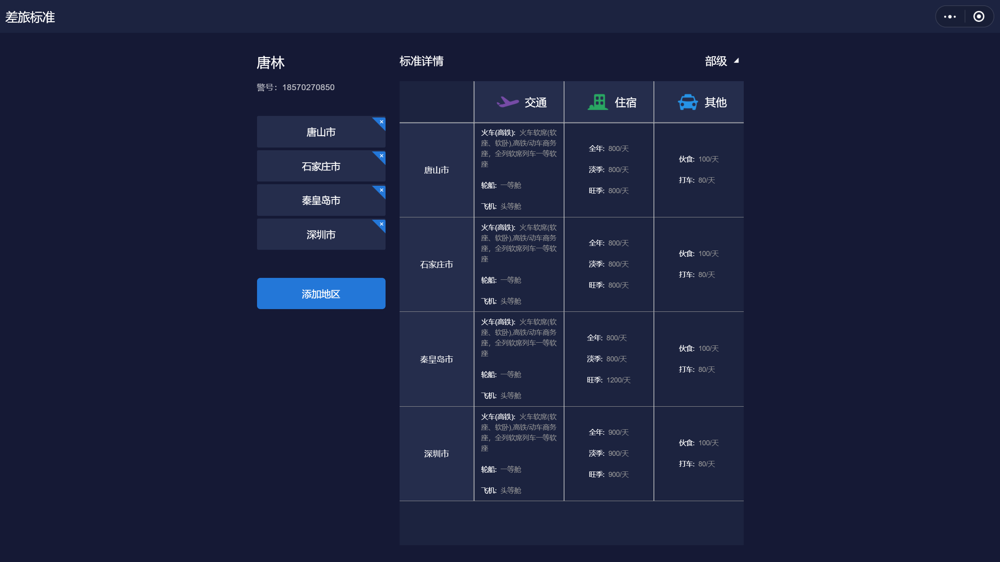
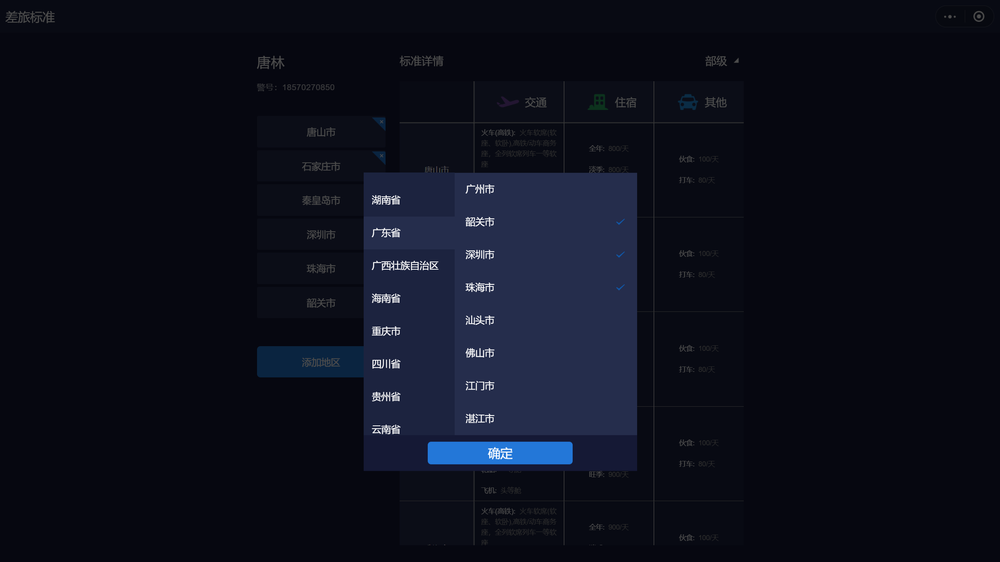

---

layout: appHelpDocsLayout

title: 差旅标准-大屏

---
<ul>
   <li><a href="#home">1.应用首页</a></li>
   <li><a href="#add">2.添加城市</a></li>
</ul>

### 1.应用首页

左侧展示已添加城市列表，右侧展示已添加城市的标准详情。标准详情的右上角按钮可选择级别展示不同的数据。

### 2.添加城市

点击添加地区按钮添加城市可勾选多个城市，点击确认按钮后添加完成。

