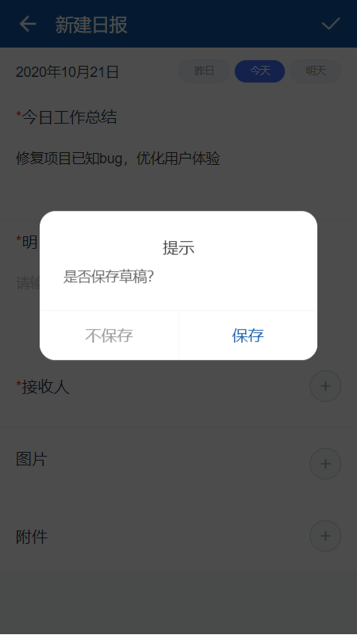

---

layout: appHelpDocsLayout

title: 工作汇报

---

#### 开始使用 

* [1、应用首页](#home)
* [2、更多](#more)
* [3、新建](#add)
* [4、详情](#detail)

##### 1. 应用首页  
进入首页，导航栏图标依次是搜索、更多以及退出应用，
点击切换内容列表（我发出的、收到的）
右下图标进入新建汇报。

#### 2. 更多  
左上角可以返回首页，内容分为应用版本及开发公司相关信息。

#### 3. 新建  
可以选择任意类型进行汇报创建。

进入新建界面输入内容，选择时间，选择发送给指定的人，上传图片、附件，输入完内容可点击右上角进行提交。

倘若输入内容不打算提交，退出时将会提示是否保存为草稿。（保存后可在首页对其进行编辑删除）

#### 4. 详情  
点击图片可以放大查看，点击附件可以进行下载。最底部可对该汇报进行评论等相关操作。（可对草稿进行内容编辑）

点击阅读人数可查看发送、已读、未读人员情况。

