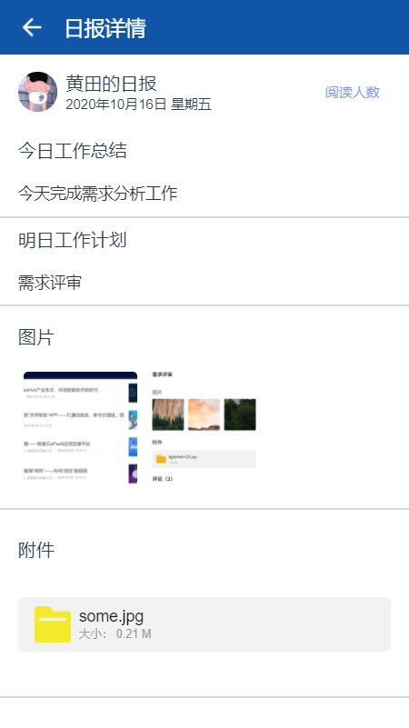
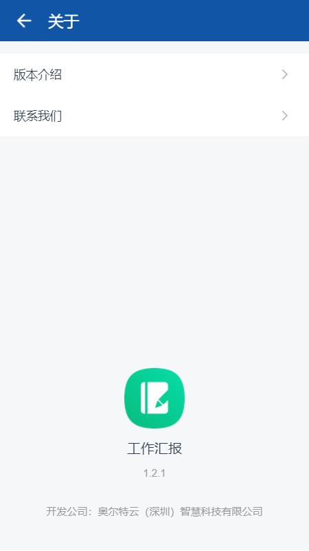

---

layout: appHelpDocsLayout

title: 工作汇报

---

#### 开始使用 

* [1、应用首页](#home)
* [2、新建](#add)
* [3、详情](#detail)
* [4、更多](#more)

##### 1. 应用首页  
进入首页，顶部栏图标依次是【搜索】、【更多】以及【退出应用】。

点击【我发出的】、【我收到的】切换列表内容，点击【右下图标】进入新建汇报。

#### 2. 新建  
可以选择任意类型进行汇报创建。

进入新建界面输入内容，选择时间，选择发送给指定的人，上传图片、附件，输入完内容可点击【右上图标】进行提交。

倘若输入内容不打算提交，退出时将会提示是否保存为草稿。（保存后可在首页对其进行编辑删除）

#### 3. 详情  
点击【图片】可以放大查看，点击【附件】可以进行下载。最底部可对该汇报进行【评论】等相关操作。（可对草稿进行内容编辑）

点击【阅读人数】可查看发送、已读、未读人员情况。

#### 4. 更多  
点击【左上角】可以返回首页，内容分为应用版本和开发公司相关信息。

