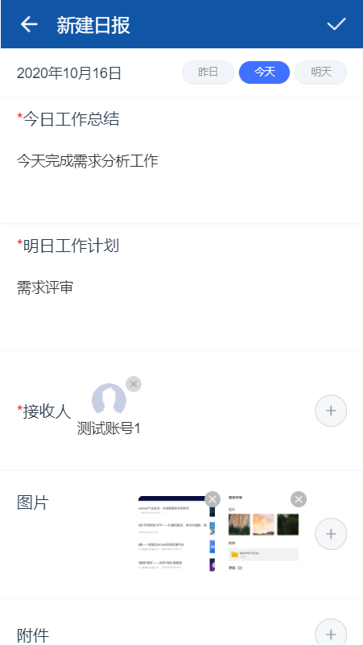

---

layout: appHelpDocsLayout

title: 工作汇报

---

#### 开始使用 

##### 应用首页
##### 1. 导航栏图标依次是搜索、更多以及退出应用。
##### 2. 点击切换（我发出的、收到的列表）
##### 3. 右下图标是新建汇报

#### 关于界面

#### 新建汇报
##### 1. 可以选择任意类型进行创建

##### 2. 进入新建界面输入一系列内容，可选择时间，上传图片、附件。输入完内容可点击右上角进行提交

#### 汇报详情
##### 1. 点击图片可放大查看，点击附件进行下载

##### 2. 点击阅读人数查看具体情况，底部可进行评论

