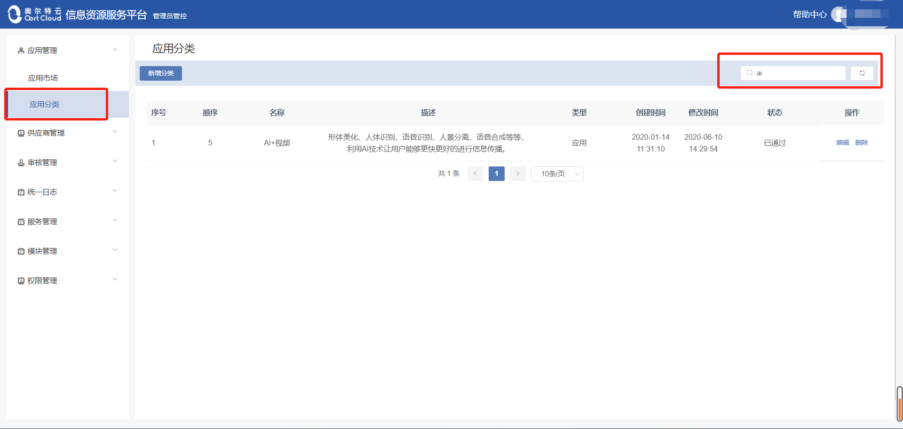
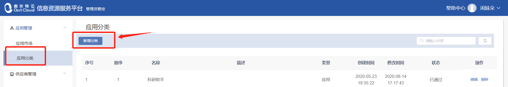
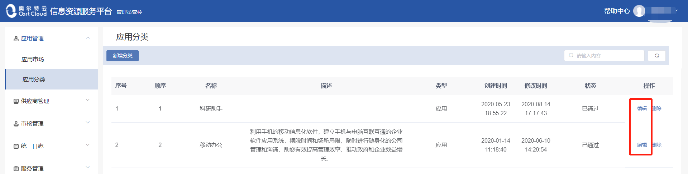
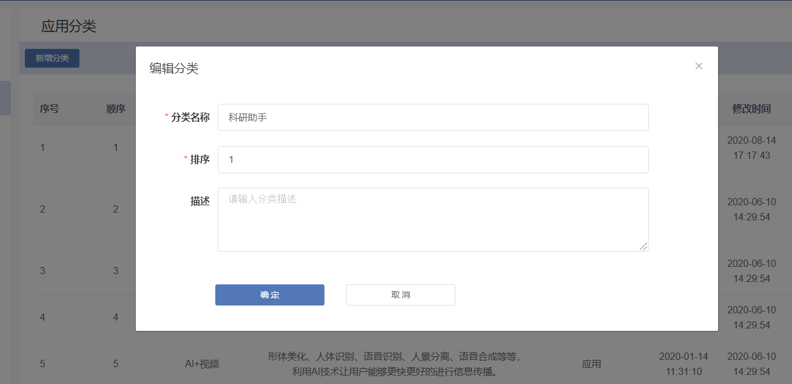
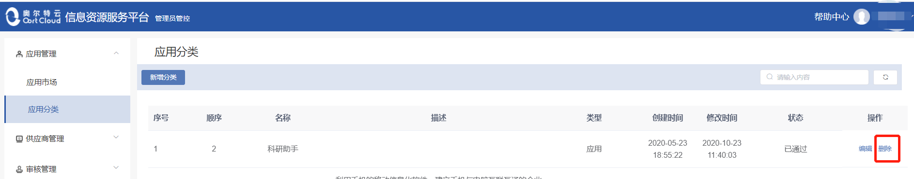

# 管理员平台

<ul>
   <li><a href="#introduce">1、平台登录</a></li>
   <li><a href="#apply_manage">2、应用管理</a></li>
   <li><a href="#supplement_manage">3、供应商管理</a></li>
   <li><a href="#shenhe_manage">4、审核管理</a></li>
   <li><a href="#tongyi_manage">5、统一日志</a></li>
   <li><a href="#sevice_manage">6、服务管理</a></li>
   <li><a href="#mokuai_manage">7、模块管理</a></li>
   <li><a href="#privilge_manage">8、权限管理</a></li>
</ul>

### 平台介绍 

#### 管理员平台可以做什么
- 管理员平台是一个集应用统一管控、供应商统一管控、业务审核、业务查询、服务管理、应用模块化管理以及人员、应用、服务权限统一管控的一站式管理平台。
管理员通过此平台可以进行应用的上线、下线、审核、分类管理；赋予不同人员的不同权限（权限赋予/权限回收）；查看人员的业务操作记录等，方便管理员对公司业务的管理。

### 1 、平台登陆

通过登陆界面输入用户名及密码进入管理员管控平台。

登录成功后进入首页，管理员平台可以对应用进行统一集中管控。

进入首页，通过左侧侧边栏可以看到管理员平台一共有应用管理、供应商管理、审核管理、统一日志、服务管理、模块管理、权限管理七大模块。每个模块都有各自不同的操作业务。

### 2.应用管理 

 应用管理模块可以查看全部的应用以及详细信息（包括已上线、已下线的应用），右上角可以定向查询应用，也可以分类查询应用，还可以导出数据等操作。
 
 - 应用类型：
    - 科研助手：让科研工作更便捷。
    - 移动办公：利用手机的移动信息化软件，建立手机与电脑互联互通的企业软件应用系统，摆脱时间和场所局限，随时进行随身化的公司管理和沟通，助您有效提高管理效率，推动政府和企业效益增长。
    - 队伍建设：带着问题学，拜人民为师，做到干中学、学中干，学以致用、用以促学、学用相长。
    - 沟通协助：一个有优秀的管理者，要想做到下级安心、上级放心、同级热心、内外齐心，必须要有良好的沟通协调能力。
    - AI+视频：形体美化、人体识别、语音识别、人景分离、语音合成等等，利用AI技术让用户能够更快更好的进行信息传播。
    - 基础工作：建立以责任制为基础的规章制度和员工技术业务培训工作等信息工作等内容。

#### 2.1 应用市场

- 2.1.1 查看应用详细信息：

    - 单击应用的版块，可以查看此应用的详细信息。包括开发单位、应用ID、应用密匙、概述、评论、历史版本、应用的类型等。

    应用ID：应用的id标识。

    应用密钥：应用的密钥，创建 app 的时候由开放平台生成，可以用于获取access_token

- 2.1.2 查看应用的使用范围，历史版本、设置应用的使用范围：

    - 点击应用右上角的【...】并选中【使用范围】可查看应用的适用范围、以往发布的所有历史版本都记录在这里。同时还可以指定应用的发布时间（立即上架/指定时间）。注意当执行应用下线时，需管理员审核通过方可生效。

- 2.1.3 对全部/已上线/已下线的应用进行分类和统计

    - 在应用市场首页的右上角处、可以看到全部的应用数量、已上线的应用数量和已下线的应用数量。
    - 在中间处可以通过切换不同的条件（全部/已上线/已下线）查看具体的应用有哪些。比如：切换【全部】
可以看到所有的应用有哪些；切换【已上线】可以看到已经上线使用的应用有哪些；切换【已下线】可以查看哪些应用是已经下线了。
    - 也可以通过点击左侧的分类导航项目，查看该类型应用的使用状态。

- 2.1.4 定向检索应用

在输入框输入关键字，根据关键字查询应用。

#### 2.2 应用分类

- 在左侧应用管理模板中可以找到【应用分类】选项，在这可以新增/删除/编辑应用分类。

- 2.2.1 查询分类

    - 可以查询所有分类的应用，也可以定向检索分类。

    

- 2.2.2 新增分类

    - 点击【新增分类】，进入对话框。输入分类名称、排序、描述，点击【确定】完成新增分类。
    

    

- 2.2.3 编辑分类

    - 点击右侧的【编辑】，进入对话框。可以对分类名称、排序、描述进行编辑。

    

    

- 2.2.4 删除分类
    - 点击右侧【删除】可删除分类。
    
    

### 3.供应商管理 

- 在左侧可以找到供应商管理模板，在此可以查询/新增/删除/编辑供应商信息

- 3.1 新增供应商：

    - 点击【新增供应商】进入添加供应商表单，需要提供供应商名称、法人代表、营业年限、企业规模、组织机构代码、详细地址、联系方式等重要信息。其中人员授权选项可以输入人员名称进行查询。

    

- 3.2 编辑供应商：可对供应商信息进行修改 。

    

- 3.3 删除供应商

    

### 4.审核管理 

对应用、应用分组、供应商的增加/修改/删除进行审核。

- 4.1 切换审核对象（应用市场/应用分类/供应商）：
    - 应用市场：对增加/删除/修改/升级/下线应用的审核。
    - 应用分类：对增加/删除/修改应用分类的审核。
    - 供应商：对添加/删除/修改供应商的审核。

    

- 4.2 查看操作记录/导出数据：

    

- 4.3 定向检索内容:
    - 可以根据提交时间和关键字定向检索
    - 也可以根据审核类型（全部/增加应用/修改应用/删除应用）和审核结果（全部/审核中/同意/不同意）定向检索
    
    

### 5.统一日志 

   - 可以查看操作日志（序号、操作用户、ip、日志内容、操作时间），可将日志数据导出，可根据提交时间和内容定向检索日志。
   
   

### 6.服务管理 

- 服务管理模块是管理所有供应商的服务（包括添加/修改/删除服务）。

    

- 6.1 添加服务：

    

    - 实现服务的南北向流量管控，白名单管控。提供针对服务接口级的限流，访问IP，资源白名单控制功能。以及后台服务管理配置功能。API编排，认证，鉴权。

- 6.2 编辑服务
    - 点击右侧【编辑】，进入编辑服务对话框。

    

- 6.3 配置服务
    - 点击右侧【配置】，进入编辑服务对话框。

    

- 6.4 节点

- 6.5 定向检索服务
    - 在输入框输入关键字，根据关键子搜索。
    
    

### 7.模块管理 

- 将应用进行模块化管理，可以添加/删除/编辑模块，移动模块位置。添加/删除模块里面的应用，移动应用位置。
    - 默认模块：添加/修改/删除模块，添加/删除模块应用，移动模块/应用的位置，是否在首页显示。
    - 用户模块：添加/修改/删除模块，添加/删除模块应用，移动模块/应用的位置，是否启用模块。

    

#### 7.1 默认模块

- 将应用设置成默认应用。

    

- 7.1.1 应用分类类型：

- 按设备分安卓、ios两大板块。

    

- 7.1.2 添加模块:

    - 输入模块名称、是否启用模块，点击【确定】按钮。

    

- 7.1.3 添加模块的应用:

    - 点击模块里面的【+】号，弹出应用列表。选中应用、保存即可。

    

- 7.1.4 管理模块

- 可删除应用、调整模块里面的应用位置以及模块的位置，重新命名模块的名称操作

    

####7.2 用户模块

- 对所有用户的应用进行模块化管理

    

- 7.2.1 应用分类类型：

- 同样按设备分为安卓、ios设备的应用

    

- 7.2.2 给用户添加模块

    

- 7.2.3 添加模块应用

    

- 7.2.4 恢复默认设置

    

- 7.2.5 定向检索用户的模块应用

    

- 7.2.6 管理模块

    - 可删除应用、调整应用的位置，重新命名模块的名称操作。鼠标按住应用图标可进行应用位置的移动。

    

### 8.权限管理 

- 集中统一管理人员的使用权限。可赋予人员权限、角色、权限配置

    

#### 8.1 人员授权

- 可以查看所有部门的所有人的权限情况，编辑人员的权限，添加权限，删除权限。

    

- 8.1.1 定向检索人员的权限情况

    

- 8.1.2 编辑人员权限

    - 点击右侧【编辑】进入对话框，选择角色，确定授权。

    

- 8.1.3 删除权限

    - 点击右侧【编辑】进入编辑对话框，点击角色名称右上角的删除符号确定删除。

    

#### 8.2 角色管理

- 统一集种管理角色的权限，查询角色具有哪些操作权限、编辑角色的权限。

    

- 8.2.1 查询角色及权限

    - 查询有哪些角色，以及该角色拥有哪些权限

    

- 8.2.2 添加角色

    - 点击【添加】按钮，进入添加角色对话框。输入角色名称、角色描述，点击【确定】按钮。

    

- 8.2.3 编辑角色

    - 可重命名角色名称，角色描述。

    

- 8.2.4 删除角色

    

- 8.2.5 授予人员角色

    - 点击【授权人员列表】进入角色授详情对话框。查看当前的角色名称，以及具有该角色的所有人员同时可为具体人员赋予该角色。

    

    

#### 8.3 权限配置

- 给哪些应用具有哪些权限

    

