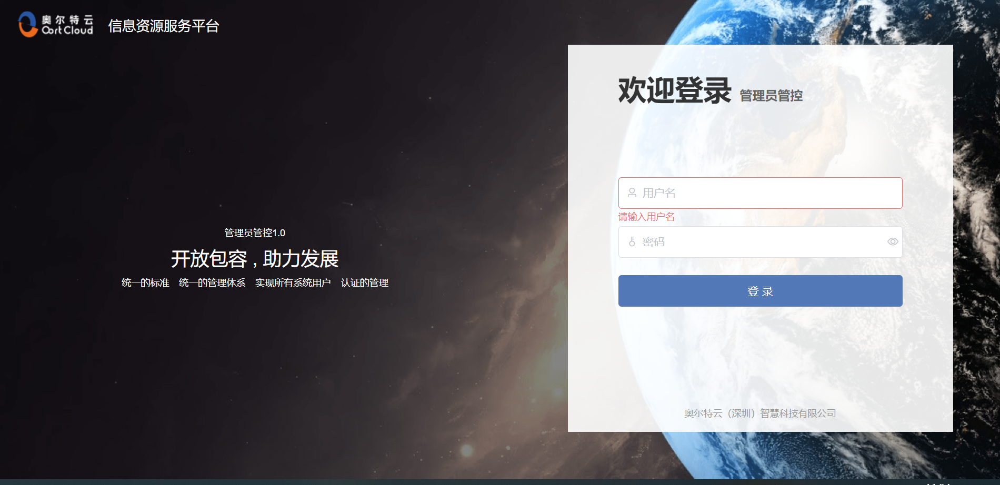
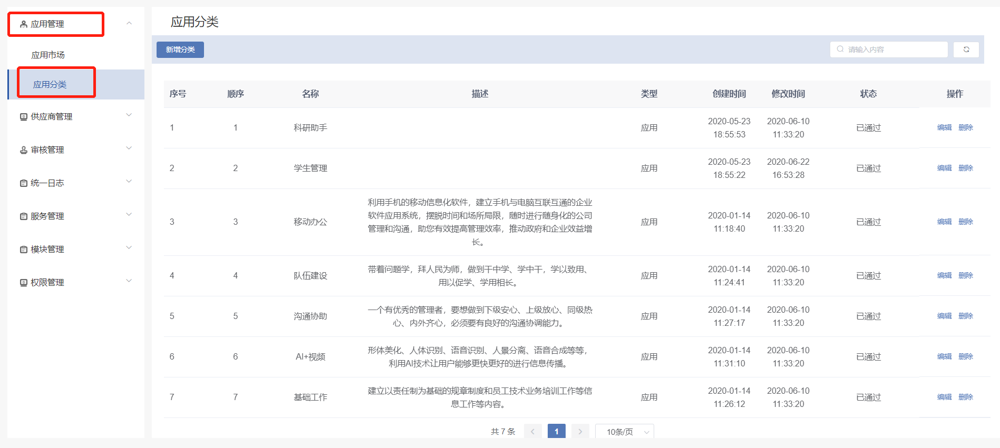
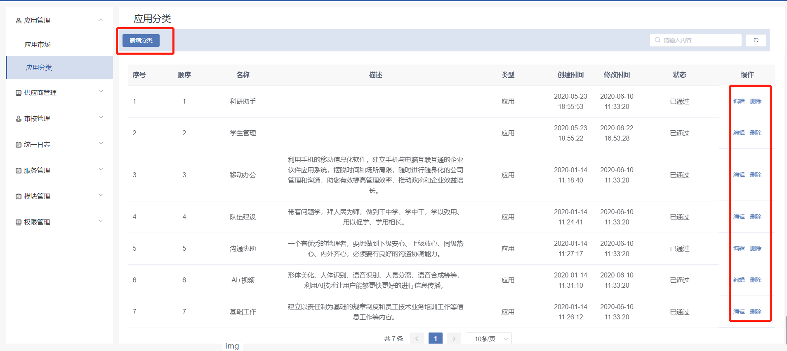
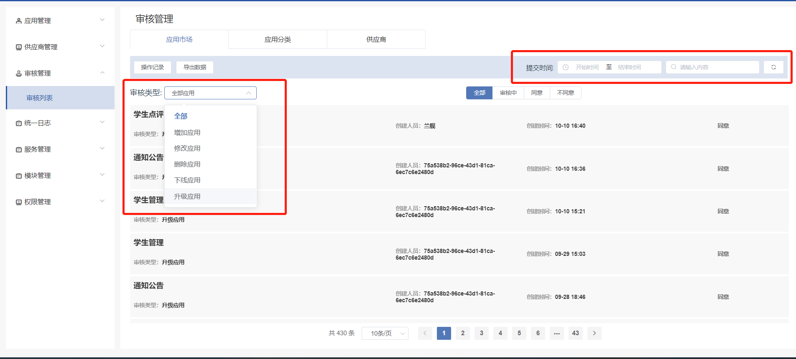
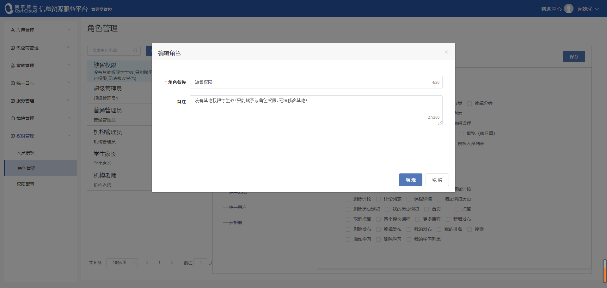
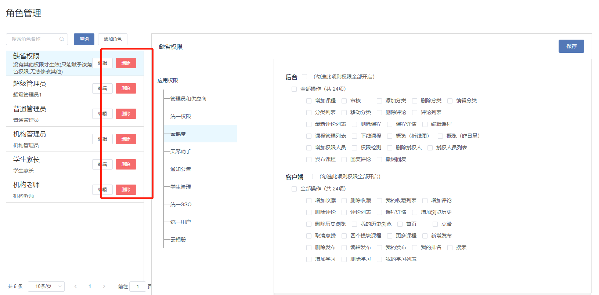

# 管理员平台

### 1.登陆平台
通过网站
http://oort.oortcloudsmart.com:42610/oort/oortcloud-frontservice/admin_manage/index.html#/
 进入管理员管控平台。输入用户名及密码进行登录。
 

登录成功后进入首页，管理员平台可以对应用进行统一集中管控。

进入首页，可以看到一共有应用管理、供应商管理、审核管理、统一日志、服务管理、模块管理、权限管理几大模块。

### 2.应用管理
应用管理模块可以查看全部的应用信息（包括已上线、已经、下线的应用），右上角可以定向查询应用，也可以分类查询应用，还可以导出数据等操作。

#### 2.1 应用市场
- 2.1.1 查看应用详细信息：

单击某个的版块，可以查看此应用详细信息。
（开发单位、应用ID、应用密匙、概述、评论、历史版本等。）

- 2.1.2 查看应用的使用范围，历史版本。并可以对应用的适用范围进行设置。

- 2.1.3 对全部/已上线/已下线的应用进行分类和统计

- 2.1.4 定向检索应用

#### 2.2 应用分类
- 设置应用分类：在左侧应用管理模板中可以找到应用分类选项，在这可以新增/删除/编辑应用分类。

### 3.供应商管理
- 在左侧可以找到供应商管理模板，在此可以新增/删除/编辑供应商信息

- 3.1 新增供应商：需要提供供应商名称、法人代表、营业年限、企业规模、组织机构代码、详细地址、联系方式等重要信息。

- 3.2 编辑供应商：可对供应商信息进行修改。

- 3.3 删除供应商

### 4.审核管理
对应用、应用分组、供应商的增加/修改/删除进行审核。

- 4.1 切换审核对象（应用/应用分类/供应商）：

- 4.2 查看操作记录/导出数据：

- 4.3 定向检索内容:
    - 可以根据提交时间和关键字定向检索
    - 也可以根据审核类型（全部/增加应用/修改应用/删除应用）和审核结果（全部/审核中/同意/不同意）定向检索
    

### 5.统一日志
查看操作日志（序号、操作用户、ip、日志内容、操作时间），可将日志数据导出，可根据提交时间和内容定向检索日志。

### 6.服务管理
服务管理模块是管理所有供应商的服务。

- 6.1 添加服务：

实现服务的南北向流量管控，白名单管控。提供针对服务接口级的限流，
访问IP，资源白名单控制功能。以及后台服务管理配置功能。API编排，认证，鉴权。

- 6.2 编辑服务

- 6.3 配置服务

- 6.4 节点

- 6.5 定向检索服务

### 7.模块管理
将应用进行模块化管理，可以添加/删除/编辑模块，移动模块位置。添加/删除模块里面的应用，移动应用位置。

#### 7.1 默认模块
将应用设置成默认应用。

- 7.1.1 应用分类类型：

按设备分安卓、ios两大板块。

- 7.1.2 添加模块:

输入模块名称、是否启用模块，点击确定按钮。

- 7.1.3 添加模块的应用:

点击模块里面的【+】号，弹出应用列表。选中应用、保存即可。

- 7.1.4 管理模块

可删除应用、调整模块里面的应用位置以及模块的位置，重新命名模块的名称操作

####7.2 用户模块
对所有用户的应用进行模块化管理

- 7.2.1 应用分类类型：

同样按设备分为安卓、ios设备的应用

- 7.2.2 给用户添加模块

- 7.2.3 添加模块应用

- 7.2.4 恢复默认设置

- 7.2.5 定向检索用户的模块应用

- 7.2.6 管理模块
可删除应用、调整应用的位置，重新命名模块的名称操作

### 8.权限管理
集中统一管理人员的使用权限。可赋予人员权限、角色、权限配置

#### 8.1 人员授权
可以查看所有部门的所有人的权限情况，编辑人员的权限，添加权限，删除权限。

- 8.1.1 定向检索人员的权限情况

- 8.1.2 编辑人员权限
点击右侧【编辑】进入对话框，选择角色，确定授权。

- 8.1.3 删除权限
点击右侧【编辑】进入编辑对话框，点击角色名称右上角的删除符号确定删除。

#### 8.2 角色管理
统一集种管理角色的权限，查询角色具有哪些操作权限、编辑角色的权限。

- 8.2.1 查询角色及权限

查询有哪些角色，以及该角色拥有哪些权限

- 8.2.2 添加角色

点击【添加】按钮，进入添加角色对话框。输入角色名称、角色描述，点击【确定】按钮。

- 8.2.3 编辑角色

可重命名角色名称，角色描述。

- 8.2.4 删除角色

- 8.2.5 授予人员角色

点击【授权人员列表】进入角色授详情对话框。查看当前的角色名称，
以及具有该角色的所有人员同时可为具体人员赋予该角色。

#### 8.3 权限配置

给哪些应用具有哪些权限

