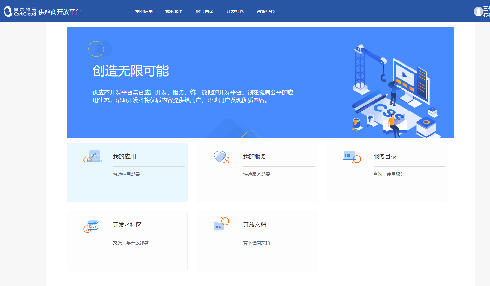
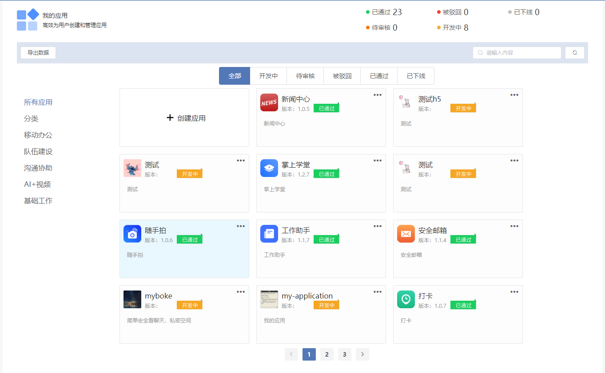
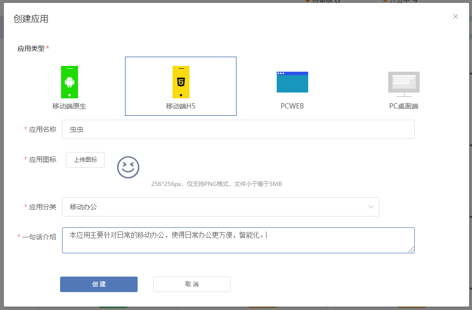
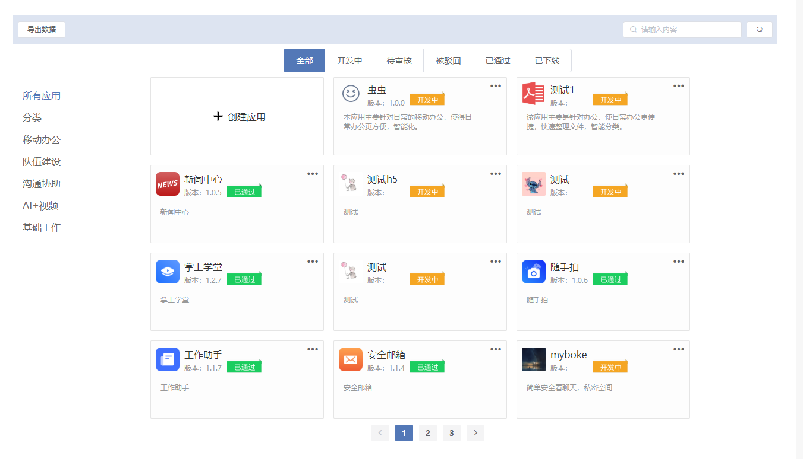
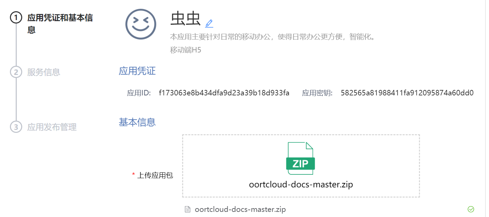
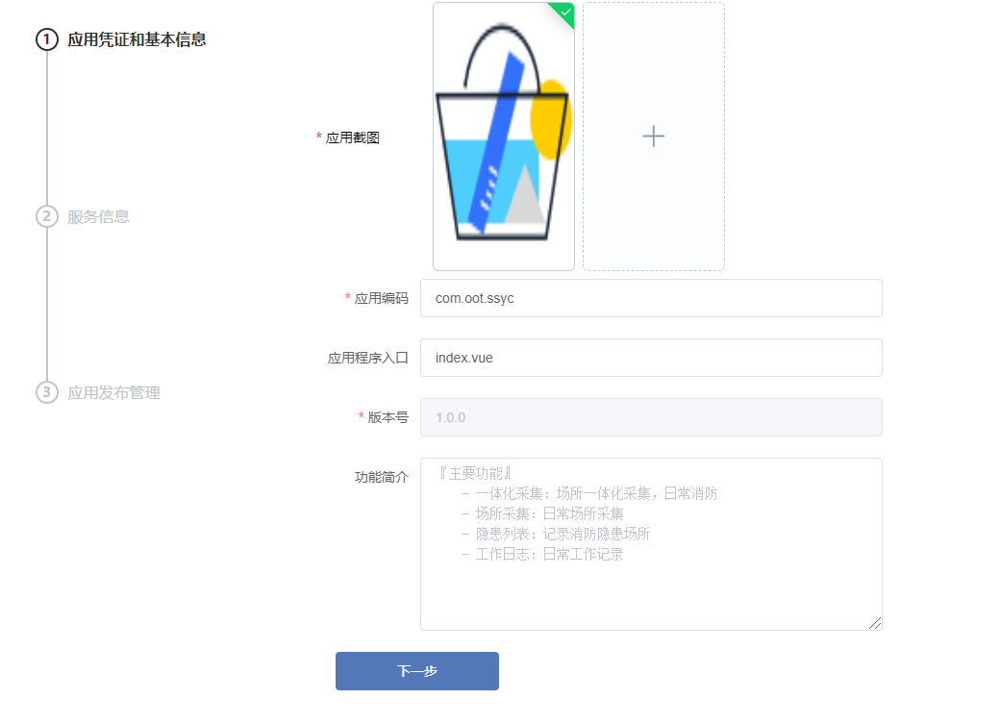
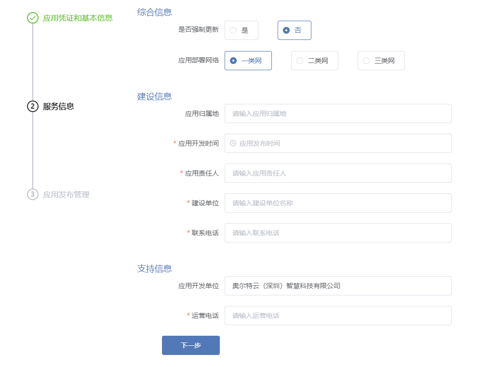
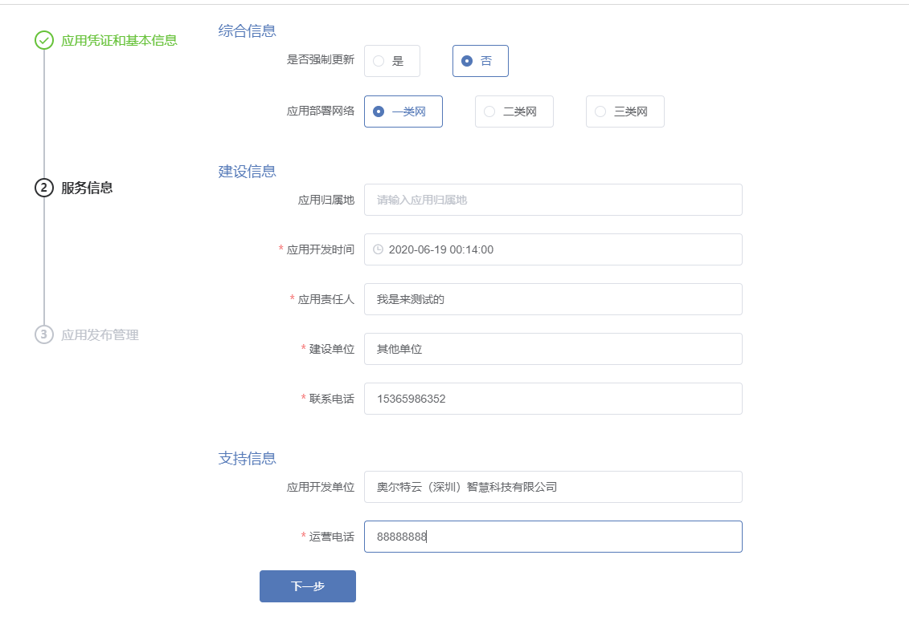
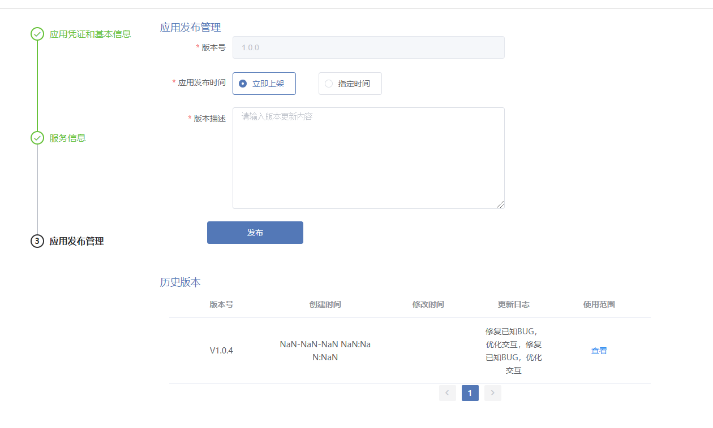

# 应用分类 

## H5轻应用
### 定义
H5是指第5代HTML，也指用H5语言制作的一切数字产品。
所谓HTML是“超文本标记语言”的英文缩写。“超文本”是指页面内可以包含图片、链接，甚至音乐、程序等非文字元素，而“标记”指的是这些超文本必须由包含属性的开头与结尾标志来标记。我们上网所看到的网页，多数都是由HTML写成。它是一种高级网页开发技术，他不是一种标记语言，为下一代web提供了全新的框架和平台，包括提供免插件的音视频、图像动画、本体存储以及更多重要的功能。相比H4,H5有更多的交互和功能，并且支持在移动设备上支持多媒体。
### 应用
H5的应用很广泛，基于H5有很多产品载体，比如PPT、APP等，但这些产品载体在实现过过程中，也会用到其他的技术。
而从营销层面，最常用的是H5页面，这些页面可以单独传播，即H5海报，也可以嵌入公众号，嵌入APP、嵌入小程序等，这种形式并不仅仅可以在微信端显示，作为一个页面，获取链接后，也可以在PC端打开。
目前主要的形式包括：
- HTML5的游戏开发
- 轻应用、Web App、微站，网站包括PC端和移动端，响应式网站适配不同的终端
- Hybrid App
- 基于微信平台的开发
- Web VR让虚拟现实大众化
- 动漫、二次元

## pcweb应用

## 移动端原生应用
- 原生开发（Native App开发），是在Android、IOS等移动平台上利用官方提供的开发语言、开发类库、开发工具进行App开发。比如Android是利用Java、Eclipse、Android studio；IOS是利用Objective-C 和Xcode进行开发。
### 优点：
1. 可访问手机所有功能（如GPS、摄像头等）、可实现功能最齐全；
2. 运行速度快、性能高，绝佳的用户体验；
3. 支持大量图形和动画，不卡顿，反应快；
4. 兼容性高，每个代码都经过程序员精心设计，一般不会出现闪退的情况，还能防止病毒和漏洞的出现；
5. 比较快捷地使用设备端提供的接口，处理速度上有优势。

### 缺点：

1. 开发时间长，快则3个月左右完成，慢则五个月左右；
2. 制作费用高昂，成本较高；
3. 可移植性比较差，一款原生的App，Android和IOS都要各自开发，同样的逻辑、界面要写两套；
4. 内容限制（App Store限制）；
5. 必须等下载完毕用户才可以打开，获得新版本时需重新下载应用更新。
6. 新需求迭代，上线慢。

## 创建应用

### 登录供应商开发平台

在浏览器地址栏，输入 http://oort.oortcloudsmart.com:32610/oort/oortcloud-frontservice/supplier_manage/index.html#/login 并登入，然后登录你的账户 点击登录按钮，完成登录

进入网站首页、并点击“我的应用”就可以创建应用啦

### 创建应用

#### 一、点击[ + 创建应用]

#### 二、在弹出框里填写应用的类型、名称、应用图标、分类、以及应用的简单概要信息

#### 三 、点击创建

这样我们在页面就可以看到刚刚创建的名为“虫虫”的应用。

#### 四、应用凭证和基本信息
- 在创建应用后，会自动生成一个唯一对应的应用ID和应用密钥。在这里需要继续完善应用的基本信息，上传应用包、应用截图、应用编码，版本号等必须项。另外为了其他使用者更快了解应用，还可以填写应用的程序入口以及应用功能的简介。
- 点击应用名称旁边的【🖊】进入编辑状态，可以把应用根据应用功能又分为移动办公、队伍建设、沟通协助、AI+视频、基础工作。

#### 五、下一步
#### 六、设置服务信息
服务信息主要有3大项：
- 综合信息：
    - 是否强制更新，默认为否。
    - 应用部署网络：默认一类网。
- 建设信息：应用归属地、应用开发时间、应用责任人、建设单位、联系电话。
- 支持信息：应用开发单位、运维电话

#### 七、应用发布管理
此步骤表明应用的版本号，应用的发布时间、以及当前发布版本的应用描述（新功能、新特性等）

至此，一个完整的应用就创建完成了。后面可以对应用进行应用、管理、以及更新。

## 开发应用 

### 开发pc web端应用 

### 开发H5 移动端应用

### 开发原生android, ios应用

## 发布应用 

## 升级应用

