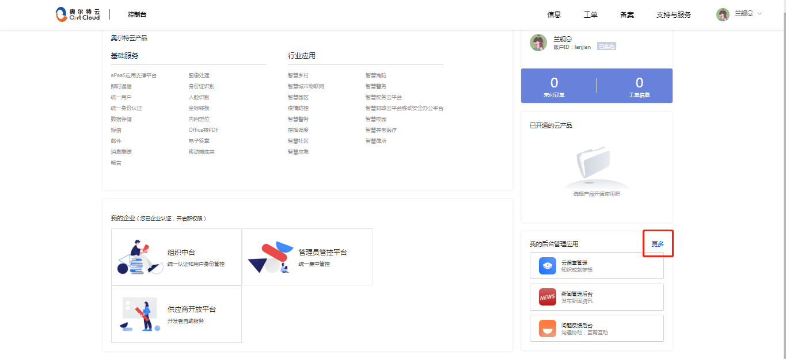

---

title: 控制台使用手册

---

# 控制台使用手册

<ul>
    <li><a href="introduce">1，控制台台概述</a></li>
    <li><a href="dl">2，控制台登录</a></li>
    <li><a href="sy">3，首页</a></li>
    <li><a href="dhl">4，导航栏</a></li>
    <li><a href="cp">5，公司产品</a></li>
    <li><a href="qy">6，我的企业</a></li>
    <li><a href="dd">7，订单区</a></li>
    <li><a href="yy">8，我的后台管理应用</a></li>
</ul>

## 1.  控制台概述 

控制台是方便供应商购买产品后进行查看。

本控制台共有五大区域：导航栏区、公司产品区、我的企业区、我的后台管理应用区，通过本手册使用介绍，让使用者更快熟悉本平台操作。

## 2.  控制台登录 

### 2.1 在浏览器中输入网址并登录

登录你的账户，点击登录按钮，完成登录。

### 2.2 登录后的页面

## 3.  首页 

### 3.1 首页五个区域

登录页面后就进入首页，首页共有以下五个区域：
- 导航栏区：信息、工单、备案、支持与服务的入口区域；
- 公司产品区：公司产品展示入口区域；
- 我的企业区：统一用户、管理员、供应商的平台入口区域；
- 订单区：订单信息展示入口区域；
- 我的后台管理应用区：开发的应用管理入口区域；

### 3.2 密码修改

### 3.3 退出登录

## 4.  导航栏 

导航栏区域是信息、工单、备案、支持与服务的入口区域。
- 信息：信息展示；
- 工单：可查看工作单据详情；
- 备案：可进行网站备案；
- 支持与服务：提供的支持以及相应的各种服务；

### 4.1 信息

### 4.2 工单

随着业务的开展，企业的工单类型呈现多样化，为有效管理、获悉服务状态、掌握工单真实性、进行满意度回访或服务评价等服务，奥尔特云为您提供专业的解决方案：
- 对服务流程进行全方位标准化管理和监控；
- 对服务人员进行实时派单返单、超时提醒、跟踪定位、监督管控、业绩考核；
- 提高服务质量与用户满意度；

### 4.3 备案

在中华人民共和国境内提供互联网信息服务，应当依法履行ICP备案手续，本平台可提供备案服务。

### 4.4 支持与服务

提供专业技术服务，以及多样化的支持计划和专家服务，满足从上云部署、日常运维到优化升级等的全周期需求，让数字化转型之路更加高效敏捷。

## 5.  公司产品 

公司发布的产品集合区，点击各个产品名称可进入查看产品详情。

## 6.  我的企业 

三大平台入口：组织中台、管理员管控平台、供应商开放平台。

## 7.  订单区  

## 8.  我的后台管理应用 

后台管理的应用在此出现，点击应用模块可进入该应用管理页，点击“ 更多 ”可查看所有应用和管理应用。

### 8.1 点击应用模块

点击应用，可直接进入该应用详情页面，可进行该应用的管理操作。进入应用页面一般有应用概览和应用管理两个功能。

#### 8.1.1 应用概览

应用概览主要是应用使用情况统计。

#### 8.1.2 应用管理

根据每个应用的性质进行管理，主要对应用内信息的发布的管理，有下线、删除、编辑、查看等操作。

## 8.2 点击“更多”

可查看所有发布的应用，点击应用模块可进入该应用的详情页以及管理应用。

