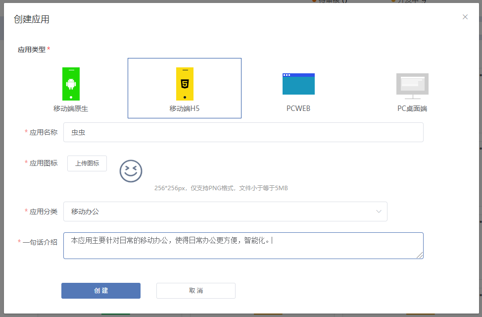
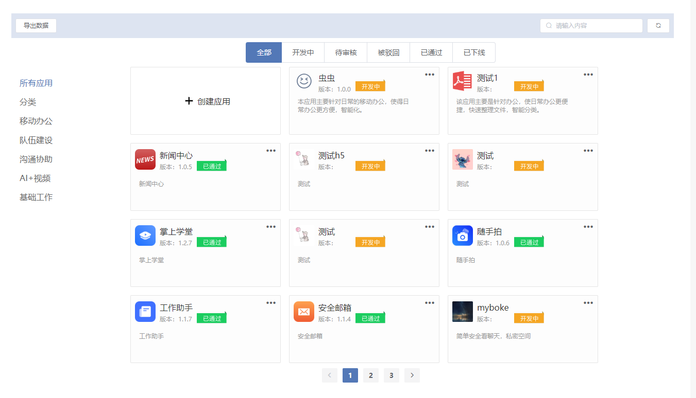

# 快速入门

## 开放平台概述
欢迎使用`奥尔特云开发平台文档`，使用过程中如碰到问题，请到[Github](https://github.com/OortCloudGroup/oort-docs/issues)进行提问。  
开放平台是指软件系统通过公开其应用程序编程接口（API）或函数（function）来使外部的程序可以增加该软件系统的功能或使用该软件系统的资源，而不需要更改该软件系统的源代码。
本开发平台主要以vue框架，html语言，实现移动端原生，移动端H5，PCWEB和PC桌面端等应用的协同开发，
主攻于移动办公、队伍建设、沟通协助、AI+视频和一些基础工作等方向，全面支持奥尔特云应用开发与管理。
致力于打造“开放”、“便捷”、“全面”、“资源共享”的平台标准，实现开发资源的最大化。

## **通过平台能做什么**

开发者是开放生态的主要组成部分，通过与商家、消费者的合作，提升商家的服务效率和营收，降低运营成本，使消费者的体验更便捷、更愉悦、更完美。无论你是第三方开发者、系统商、线下推广组织还是商家，都能基于开放平台找到适合自己的角色和方向。

### **插件提供商：**

通过我们提供的丰富的 API 接口，开发者可以开发并在应用市场上线各类插件，解决门店管理、支付核销、会员营销、数据分析等方面的问题。开放平台还为各种应用提供了清晰的盈利模式，通过应用市场的销售获得回报。

### **服务提供商：**

在应用市场之外，合作伙伴还可以通过服务市场为商家提供店铺装修、拍摄修图、地面推广、门店代运营等服务。实现线上订购，线下服务。

### **场景分销商：**

第三方 APP 或媒介可以借助支付宝开放平台的分销能力为商家提供基于门店、卡券、内容的分销服务，为商家的流量导入、品牌推广提供平台。分销商可以为所提供的服务获取收入。

## **平台的优势**

### 业务优势
- 一站式商家服务：为商家提供支付、门店、营销、数据等一站式服务。
- 海量的实名用户：4 亿实名用户，迅速沉淀会员信息玩转会员体系。
- 丰富的线下场景：超过 50 万家线下门店，包括餐饮、超市等多种行业场景。

### 技术支持

- 接口支持：支付、分享、账户、营销、信用、服务窗等九大优质接口支持。
- 开发工具：包括 Java、PHP、.Net 等语言的 SDK 与 Demo 示例。
- 服务保障：丰富的技术文档，开放的技术社区，高效的在线技术服务，是你开发的坚强后盾。

### 盈利模式

- 通过应用获利：基于商家服务市场，为合作伙伴的插件及服务提供变现渠道。
- 营销咨询：基于商家的营销需求，为合作伙伴提供多元的商家增值服务。
- 代运营：合作伙伴提供商家运营托管服务，最大化商家的营销价值。

### 应用类型 

在奥尔特云开放平台，你可以根据你的需要开发应用商店应用

| 应用类型          | 应用类型描述          
| -------------    |:-------------:
| h5轻应用         |  奥陌陌移动底座上轻应用，即用即走
| andorid应用     | 奥陌陌移动底座原生应用，原生体验    
| pcweb应用       | pcweb应用

### 应用能力

 | 应用能力   |     	h5轻应用          |          	网页        |     	原生应用   
 | -------------    |:-------------:     |     :-------------:   | :-------------: 
|  适合场景       |需要用户在界面上操作的应用 |  需要用户在界面上操作的应用 |需要用户在界面上操作的应用 | 
|  使用体验        	 | 非常顺滑，接近 Native  |       	容易卡顿    |       	可快速进行简易操作        
 | 开发环境         | 	提供h5轻应用模板，快速搭建项目 | 	自行搭建开发环境   |    	提供应用模板，快速搭建项目境         
  | 授权等服务端常规 API |	✅      |                	✅      |        	✅                  
 |  特殊可使用的开放能力  	 | H5-JS-SDK     | 	web-JS-SDK    |  	原生开发sdk支持 

### 名词解释

轻应用： h5  

apaas 底座

#### 应用相关 

#### 用户相关

#### 企业相关 

#### 其他

## 创建应用

本开发平台可以创建4大类型的应用：移动端原生、移动端H5，PCWEB，PC桌面端。  
例：现以创建一个名为“虫虫”的移动端H5应用为例。

### 登录供应商开发平台

在浏览器地址栏，输入 http://oort.oortcloudsmart.com:32610/oort/oortcloud-frontservice/supplier_manage/index.html#/login 并登入，然后登录你的账户 点击登录按钮，完成登录

进入网站首页、并点击“我的应用”就可以创建应用啦

### 创建应用

#### 一、点击[ + 创建应用]

#### 二、在弹出框里填写应用的类型、名称、应用图标、分类、以及应用的简单概要信息

#### 三 、点击创建

这样我们在页面就可以看到刚刚创建的名为“虫虫”的应用。

#### 四、应用凭证和基本信息
- 在创建应用后，会自动生成一个唯一对应的应用ID和应用密钥。在这里需要继续完善应用的基本信息，上传应用包、应用截图、应用编码，版本号等必须项。另外为了其他使用者更快了解应用，还可以填写应用的程序入口以及应用功能的简介。
- 点击应用名称旁边的【🖊】进入编辑状态，可以把应用根据应用功能又分为移动办公、队伍建设、沟通协助、AI+视频、基础工作。

#### 五、下一步
#### 六、设置服务信息
服务信息主要有3大项：
- 综合信息：
    - 是否强制更新，默认为否。
    - 应用部署网络：默认一类网。
- 建设信息：应用归属地、应用开发时间、应用责任人、建设单位、联系电话。
- 支持信息：应用开发单位、运维电话

#### 七、应用发布管理
此步骤表明应用的版本号，应用的发布时间、以及当前发布版本的应用描述（新功能、新特性等）

至此，一个完整的应用就创建完成了。后面可以对应用进行应用、管理、以及更新。

## 开发应用 

### 开发pc web端应用 

### 开发H5 移动端应用

    ### 开发原生android, ios应用

## 发布应用 

