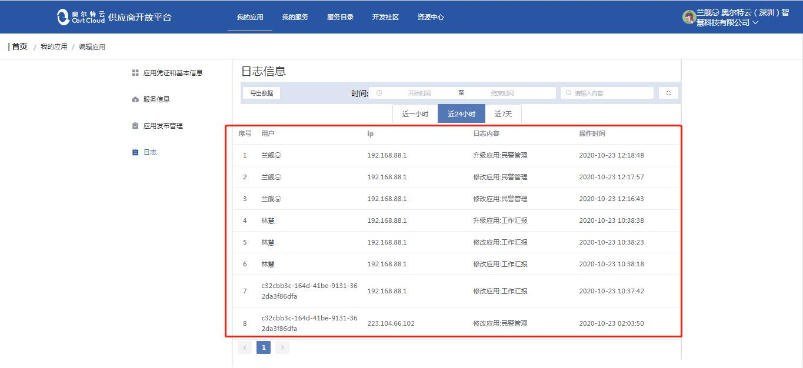

# 供应商开发平台

<ul>
    <li><a href="introduce">1，供应商开放平台概述</a></li>
    <li><a href="dl">2，平台登录</a></li>
    <li><a href="sy">3，首页</a></li>
    <li><a href="yy">4，我的应用</a></li>
    <li><a href="fw">5，我的服务</a></li>
    <li><a href="ml">6，服务目录</a></li>
    <li><a href="sq">7，开源社区</a></li>
    <li><a href="zx">8，资源中心</a></li>
</ul>

## 1. 供应商开放平台概述 

供应商开发平台主要是供应商进行应用的上线、修改、编辑处理、服务的添加、申请、技术问题的提问、开发文档的查看的操作。

本平台共有五大版块：我的应用、我的服务、服务目录、开发者社区、资源中心（开发文档），通过本手册使用介绍，使供应商更快熟悉本平台操作。

## 2. 平台登录 

### 2.1 在浏览器中输入网址并登录

登录你的账户，点击登录按钮，完成登录。

### 2.2 登录后进入首页

## 3. 首页 

首页有五大版块的入口：我的应用、我的服务、服务目录、开发者社区、资源中心（开发文档）。
也可通过网站顶部导航栏进入此五大版块，每页网站右上角都可以进行退出登录和密码修改操作。

### 3.1 密码修改

### 3.2 退出登录

## 4．我的应用 

可从首页或导航栏进入“我的应用”版块进行以下应用管理操作：
-	创建应用，应用创建入口，创建应用需要填写好应用信息；
-	升级应用，应用版本升级，操作时注意版本的填写；
-	编辑应用，应用信息的修改；
-	查看应用，应用详情的查看；
-	使用范围，也可在编辑应用中进行修改；
-	应用下线，应用下线操作；

应用列表里应用旁边会有应用状态，有以下提示状态：
-	开发中，创建应用好了但未完成应用信息时或者编辑应用时状态；
-	待审核，创建应用后并应用信息完善提交后待管理员审核状态；
-	被驳回，审核不通过状态；
-	已通过，审核通过状态；
-	已下线，应用被下线状态；

### 4.1 创建应用

#### 4.1.1 点击“+创建应用”创建应用

根据页面提示选择准备上线的应用类型，填新创建的应用信息。需要首先明确上线应用的类型，不同应用类型需要的应用信息填写有些许差别。
- a) 应用类型， 移动端原生（android）、移动端原生（ios）、移动端H5、PCWEB、PC桌面端；
- b) 应用名称， 注意命名长度在8字以内；
- c) 应用图标， 注意图标上传格式为256*256px，仅支持PNG格式，文件小于等于5MB；
- d) 应用终端类型， 移动端、大屏（华为Ideahub、iPad等）、兼容（移动端和大屏都可以）；
- e) 应用分类， 科研助手、移动办公、队伍建设、沟通协助、AI+视频、基础工作；
- f) 一句话介绍， 注意长度在256字以内；

-	移动端原生（android）

-	移动端原生（ios）

-	移动端H5

-	PCWEB

-	PC桌面端

#### 4.1.2 创建应用后继续完善应用信息

在创建应用后，会弹出一个窗户让你继续完善应用信息，它也会自动生成一个唯一对应的应用ID和应用密钥。
在这里需要继续完善应用的基本信息，上传应用包、应用截图、应用编码，版本号等必须项。另外为了其他使用者更快了解应用，还可以填写应用的程序入口以及应用功能的简介。
点击应用名称旁边的符合进入编辑状态，可以把应用根据应用功能又分为移动办公、队伍建设、沟通协助、AI+视频、基础工作。

 4.1.2.1 应用凭证和基本信息

-	有星号的为必填项，应用名称左边符合点击可修改应用名称；
-	应用凭证里的应用ID和应用密钥是创建应用的时候自动生成的；
-	基本信息中上传应用包注意第一层中有应用程序入口文件；

下一步

4.1.2.2 设置服务信息

服务信息主要有3大项：

- a)	综合信息，是否强制更新，默认为否；应用部署网络：默认一类网；

- b)	建设信息，应用归属地、应用开发时间、应用责任人、建设单位、联系电话；

- c)	支持信息，应用开发单位、运维电话 ；

下一步

4.1.2.3 应用发布管理

此步骤表明应用的版本号，应用的发布时间、以及当前发布版本的应用描述（新功能、新特性等），
点击查看可查看历史版本。

至此，一个完整的应用就创建完成了，后面可以对应用进行应用、管理、以及更新。

### 4.2升级应用

点击升级应用后会弹出一个窗口，注意里面的升级版本号的填写规范，升级版本必须大于当前应用版本号，才能触发升级更新。
点击下一步后就开始进行应用编辑，一般默认之前的选项，也可进行修改，依次为有应用凭证和基本信息修改、设置服务信息修改、应用发布管理修改。

下一步

#### 4.2.1 应用凭证和基本信息

#### 4.2.2 设置服务信息

#### 4.2.3 应用发布

### 4.3 编辑应用

可进行应用凭证和基本信息操作、服务信息操作、应用发布管理操作、日志操作。

#### 4.3.1 应用凭证和基本信息

#### 4.3.2 服务信息

#### 4.3.3 应用发布管理

#### 4.3.4 日志

应用之前进行的操作都会保留在日志信息中，可查看到之前版本操作的用户、IP、日志内容、操作时间。可按分类进行搜索日志，可导出日志数据信息。

4.3.4.1　搜索日志

4.3.4.2 查看日志信息

### 4.4　查看应用

### 4.5 使用范围

### 4.6　应用下线

### 4.7 导出数据

注意，导出的是所有应用信息的数据。

## 5. 我的服务 

开发商自己发布的服务。

### 5.1 服务查看

可直接下拉列表查看所有服务、可搜索服务、可按分类筛选服务，也可直接到服务目录模块进行查看所有服务。

### 5.2 服务添加

### 5.3 服务修改

添加后的服务，若需要进行修改，可在查看服务列表里的找到对应的服务，然后进行编辑、配置、节点操作。

### 5.4 服务编辑

## 6. 服务目录  

服务市场，API市场，平台提供的服务能力，开发商可发布到服务市场，也可申请使用应用市场中的服务。

## 7. 开源社区  

### 7.1 编辑个人信息

进入开源社区，开源社区页面的右上角点击个人头像，可进行私信和设置操作。

7.1.1 私信

可进行私信设置、发送私信、查看话题。

7.1.2 设置

设置里面可以进行用户的基本信息修改例如：性别、时区、头像、私信设置、通知设置等。

### 7.2 搜索

可搜索问题、话题、人，或者点击对应的模块进行查看。

### 7.3 发起问题

### 7.4 发现

可按分类查看所有问题，热门话题，热门用户，点击问题查看问题详情，回复问题，话题，关注用户。

### 7.5 话题

热门话题查看

### 7.6 通知

与我有关的问题、话题、用户、动态、设置等。

## 8. 资源中心 

供应商开放平台资源中心，帮助开发者解决问题，共享资源，让开发更简单，此板块共有五个分类的文档可查看，为概述，文档规范，UI/UE，应用开发，服务开发，点击文档即可查看。

