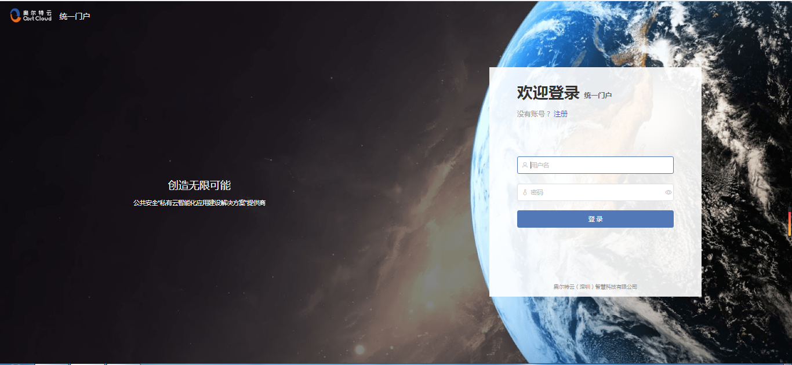
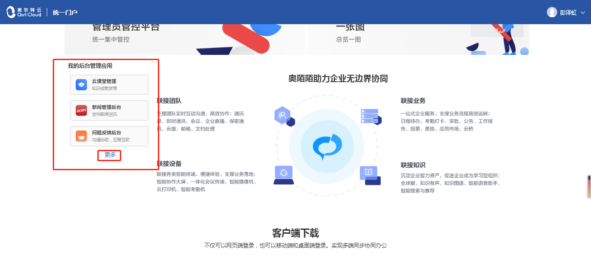
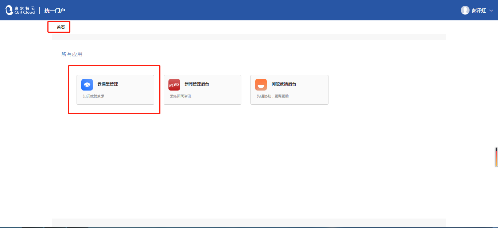

---

title: 统一门户使用手册

---

## 统一门户
### 1，平台登录
在浏览器地址栏，输入 http://oort.oortcloudsmart.com:32610/oort/oortcloud-frontservice/desktop_web/#/
并登入，然后登录你的账户 点击登录按钮，完成登录

### 2，密码修改、控制台入口、退出登录
网站右上角可进行修改密码、控制台登录、退出登录操作。

### 3，其他平台入口
四个平台的入口：统一用户平台、管理员管控平台、供应商开发平台、一张图平台，点击模块可进入对应的平台。

### 4，应用管理列表
后台管理的应用在此出现，点击“ 更多 ”可查看所有应用和管理应用。

### 5，应用管理入口
后台管理的所有应用，点击模块可进入该应用模块的后台管理。

