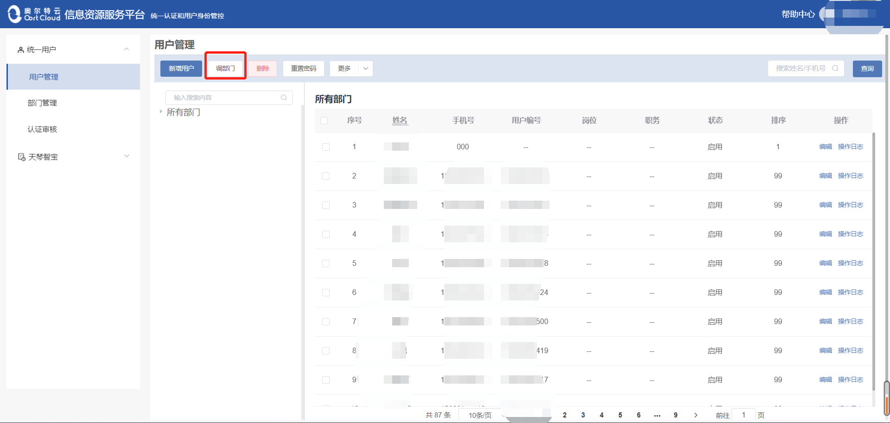

# 统一用户

<ul>
   <li><a href="#login">一、登陆平台</a></li>
   <li><a href="#user_manage">二、应用管理模块</a></li>
   <li><a href="#dept_manage">三、供应商管理</a></li>
   <li><a href="#renzheng_manage">四、审核管理</a></li>
</ul>

### 1.登录平台 

在登陆界面输入用户名和密码登入平台。

首页：

左侧侧边栏，可以看到统一用户共有用户管理、部门管理、认证审核三大模块.

### 2.用户管理 

用户管理模块可以查看所有用户的信息（姓名、手机号、用户编号、岗位、职务、状态），新增用户，调整部门，删除用户，重置密码，导入/导出数据，查看操作记录等。

 #### 2.1 新增用户
- 点击【新增用户】按钮，进入对话框输入要求的选项信息，点击【提交】按钮完成添加用户。

- 人员信息：输入姓名、电话号码、上传用户头像。
- 账号信息：登录账号、用户密码、用户部门。登陆账号系统默认设置为姓名拼音，密码随机生成，需要用户自己登录以后再去修改。

 #### 2.2 调部门
 
- 选择一名用户，点击【调部门】，在弹出窗口中输入需要调往的部门，点击【确定】，即可对该名用户进行部门调动。（注：一次只能选择一名用户，不可多选。）

 #### 2.3 删除
 
- 选择一名用户，点击【删除】，在弹出窗口中点击【确定】，即可删除该用户信息。（注：一次只能选择一名用户，不可多选。）

 #### 2.4 导数/导出数据
 
- 在顶部【更多】下拉菜单选中【导入数据】，上传相应的用户数据文件，即可导入。（注：请下载模板，按格式修改后导入。）

 #### 2.5 编辑/操作日志
 
- 编辑操作可对用户的人员信息、账号信息、联系信息、岗位信息进行详细的更改。操作日志可查看编辑记录。

- 点击用户姓名可以查看用户详细信息，再点击修改资料即可进行编辑操作：

### 3.部门管理 

在左边【统一用户】模板中可以找到【部门管理】选项：

部门管理中同样可以新增部门、调部门、删除部门、导入/导出数据、编辑操作、查看操作日志。

### 4.认证审核 

在左边统一用户模板中可以找到【认证审核】选项，可以查看全部/审核中/已通过/已驳回的审核信息，导入审核信息数据，定向检索审核信息条目。

