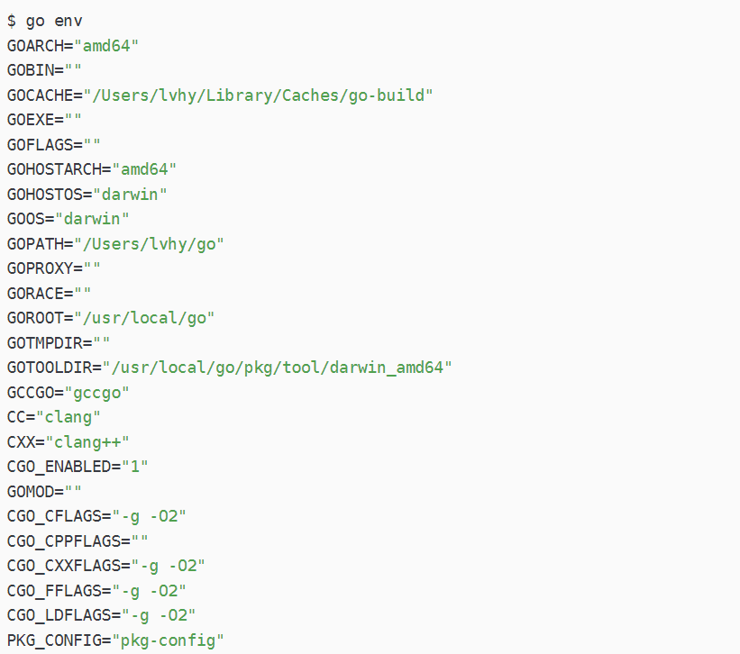
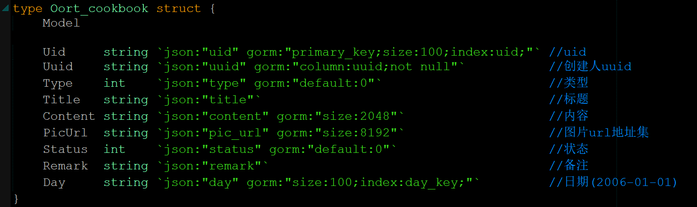
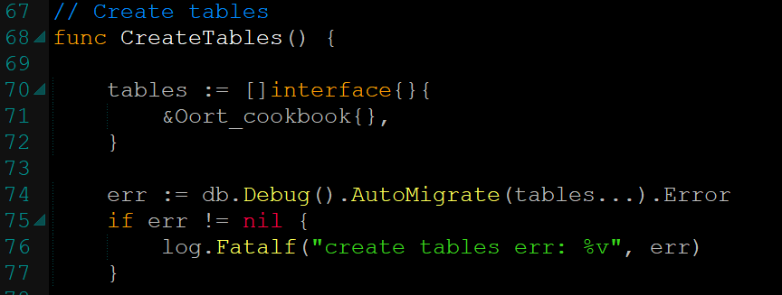
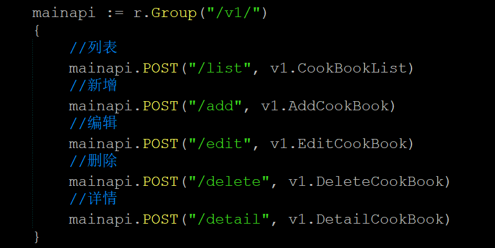
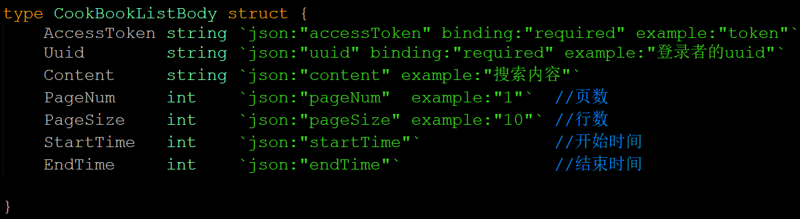
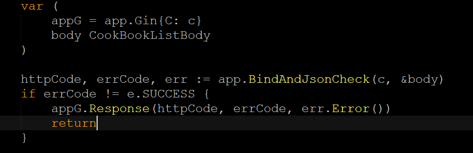
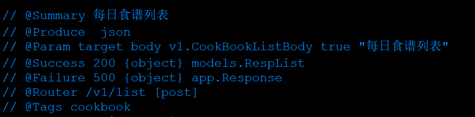
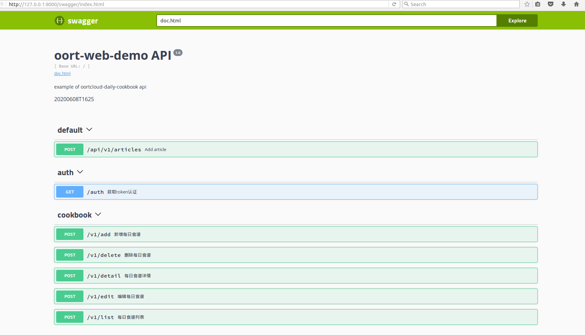

# 奥尔特云服务开发文档

本文档以开发一个go语言后台web服务为示例进行介绍。

### 搭建开发环境

#### 一、	安装go环境
###### 1、在linux下安装go
`$ wget https://studygolang.com/dl/golang/go1.13.1.linux-amd64.tar.gz`    
`$ tar -zxvf go1.13.1.linux-amd64.tar.gz`    
`$ mv go/ /usr/local/`    

###### 2、添加环境变量GOROOT
`$ export GOROOT=/usr/local/go`    
`$ export PATH=$PATH:$GOROOT/bin`    

###### 3、查看当前go的环境配置
`$go env`    

#### 二、	了解go mod
Go mod是对go的依赖包进行管理，通过mod文件我可以很好的管理项目对每一个依赖包的进行管理。在服务开发前，必须开启mod，可以使用以下命令开启    
` $ go env -w GO111MODULE=on`        
#### 三、	了解gin
Gin 是用 Go 开发的一个微框架，类似 Martinier 的 API，重点是小巧、易用、性能好很多，也因为 httprouter 的性能提高了 40 倍。

### 项目结构设计
`$ tree -L 1 go`        
    ├── conf    		--- 配置文件    
    ├── docs			---swagger目录    
    ├── middleware   ---应用中间件    
    ├── models		---model层    
    ├── pkg 			---开发工具包    
    ├── routers		---路由层    
    ├── service		---服务层    
    ├── vendor       ---本地第三方包    
    └── ...    
### 数据库设计
一、	作为一个后台web服务，数据库的使用缺少不了，我们可以不用在数据库中设计表结构，直接在代码中就可以操作。
在models目录下面创建sql_web.go文件，然后根据实际情况来设计表结构。

二、	表结构创建完毕后，我们在model.go中用代码进行自动创建表，这样程序启动就会自动根据我们设计的结构体进行表的创建。以后想要增加新的字段，直接结构体中添加完，重启服务就可以自动添加新的字段。

### 路由设计
一、	在routers下router.go创建基本的CRUD接口，也就是增删改查接口。

### Restful风格的API开发
#### 一、	Restful的风格
路由设计
参数校验
响应信息
#### 二、	参数输入并校验
我们可以通过gin的ShouldBindJSON可以很方便地将HTTP请求报文中JSON格式的Body数据解析到结构体Struct或字典Map数据结构中，进而对传入的参数进行校验。

### Swagger设计
#### 一、	什么是swagger?
Swagger 是一个规范且完整的框架，用于生成、描述、调用和可视化 RESTful 风格的 Web 服务。一个好的 API's，必然离不开一个好的API文档，如果要开发纯手写 API 文档，不存在的（很难持续维护），因此我们要自动生成接口文档。
#### 二、安装swag
`$ go get -u github.com/swaggo/swag/cmd/swag@v1.6.5`    
若 `$GOROOT/bin` 没有加入`$PATH`中，你需要执行将其可执行文件移动到`$GOBIN`下
`$ swag -v`    
`swag version v1.6.5`    

#### 三、	安装gin-swagger
`$ go get -u github.com/swaggo/gin-swagger@v1.2.0 `    
`$ go get -u github.com/swaggo/files`    
`$ go get -u github.com/alecthomas/template`    
#### 四、	编写API注释
Swagger 中需要将相应的注释或注解编写到方法上，再利用生成器自动生成说明文件。
gin-swagger 给出的范例：

#### 五、	生成swagger
我们进入到项目根目录中，执行初始化命令 swag init
`$ swag init`    
`Generate swagger docs....`    
`Generate general API Info`    
`create docs.go at  docs/docs.go`    
完毕后会在项目根目录下生成docs    
`docs/`    
`├── docs.go`    
`└── swagger`    
`├── swagger.json`    
#### 六、	验证swagger
访问一下 `http://127.0.0.1:8000/swagger/index.html`， 查看 API 文档生成是否正确

### 编译成二进制包
在我们将所有的接口都写完并生成了相应的swagger接口后，就可以对程序进行编译，编译成可以用于部署的包。
我们进入到项目根目录中，执行build命令即可生成二进制的包。    
`$ go build –o oortcloud-web`    
`$ oortcloud-web`    

### End
